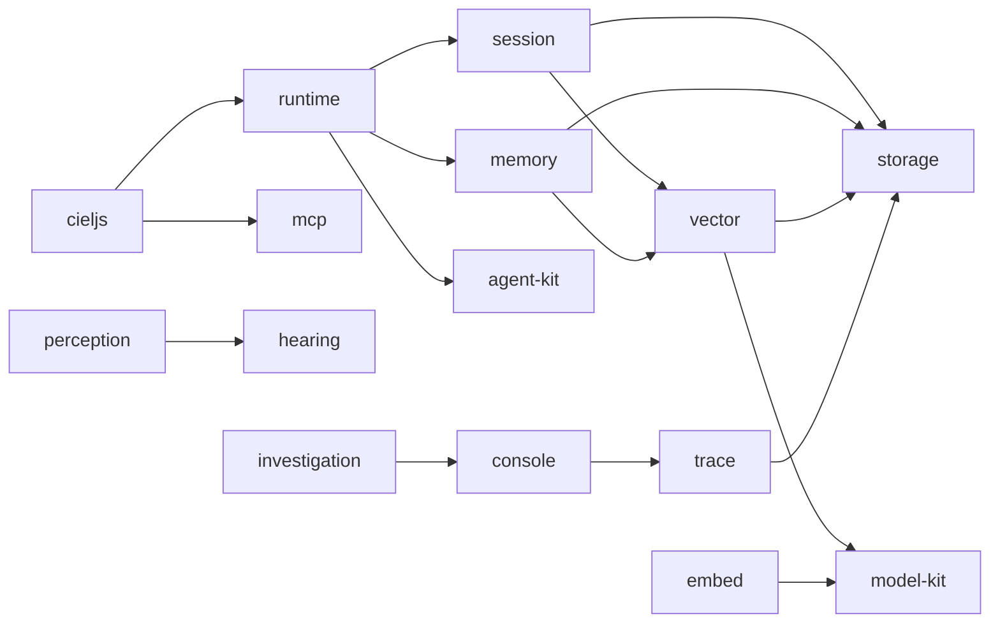

<h1 align="center">Ciel · 夏尔</h1>

<p align="center">An AI that watches streams instead of streaming — a viewer that listens, remembers, and reacts on its own.</p>

<p align="center">
  <a href="./README.zh-CN.md">简体中文</a> ·
  <a href="#about">About</a> ·
  <a href="#what-is-in-this-repository">Repository</a> ·
  <a href="#how-the-core-fits-together">Architecture</a> ·
  <a href="#getting-started">Getting started</a>
</p>

## About

Ciel (夏尔) is a personal AI agent project I have been building, and it started from a fairly abstract idea: AI streamers already exist, so what about the other side of the screen — an **AI DD**, an AI that watches a stream the way a fan does?

It watches the stream, listens to the streamer, tries to understand what is going on, tries to remember what happened before, and then reacts on its own based on all of that. The name comes from 夏尔 in _That Time I Got Reincarnated as a Slime_, a show I happen to like.

Right now Ciel understands a stream mainly through the picture, the voice and the context it already has; danmaku is not wired in at all. It does have a long-term memory mechanism, but it is not especially reliable yet — it may fail to remember, fail to recall, or simply get it wrong. So if you see it say something strange, abstract or easy to misread, that is almost always the model misreading the situation, not a deliberate jab at anyone.

The project may never turn into anything especially useful. I mostly want to see what happens if an AI really does exist long-term as a viewer. It is still being changed as I go, and if something it does looks inappropriate or easy to misunderstand, I would like to hear about it.

> The original write-up, in Chinese, is on Bilibili: <https://www.bilibili.com/opus/1247491015149879297>

## What is in this repository

This repository is the core of Ciel. Watching a stream is split into packages that also stand on their own: where facts are stored, how a conversation is remembered and compressed, how long-term memory is layered, what Ciel sees and hears, and how an agent run is traced and shown. Two applications live here as well, but they are consumers of these packages rather than part of the core.

- Composition and runtime — [`cieljs`](./packages/cieljs/README.md), [`@cieljs/runtime`](./packages/runtime/README.md)
- Memory and retrieval — [`@cieljs/session`](./packages/session/README.md), [`@cieljs/memory`](./packages/memory/README.md), [`@cieljs/vector`](./packages/vector/README.md), [`@cieljs/embed`](./packages/embed/README.md)
- Seeing and hearing — [`@cieljs/perception`](./packages/perception/README.md), [`@cieljs/hearing`](./packages/hearing/README.md)
- Foundations — [`@cieljs/storage`](./packages/storage/README.md), [`@cieljs/agent-kit`](./packages/agent-kit/README.md), [`@cieljs/model-kit`](./packages/model-kit/README.md), [`@cieljs/mcp`](./packages/mcp/README.md)
- Watching what it does — [`@cieljs/trace`](./packages/trace/README.md), [`@cieljs/console`](./packages/console/README.md), [`@cieljs/investigation`](./packages/investigation/README.md)

## How the core fits together



One `Storage` is a single PGlite instance; session, memory, vector and trace each keep their tables in a schema of their own.

## Getting started

Node 24.11+ and pnpm are required, and the workspace is driven by [Vite+](https://viteplus.dev/) through the `vp` CLI.

```bash
vp install        # after pulling changes
vp run ready      # format, lint, type check, test and build everything
vp run -r test    # tests only
vp run -r build   # build only
```

To run an application:

```bash
vp run watch-blive#dev      # Electron desktop app
vp run @cieljs/chorus#dev   # voice chat participant
```

## Documentation

There is no separate documentation site: each package's README is its documentation, and every README is written twice — `README.md` in English and `README.zh-CN.md` in Chinese.
