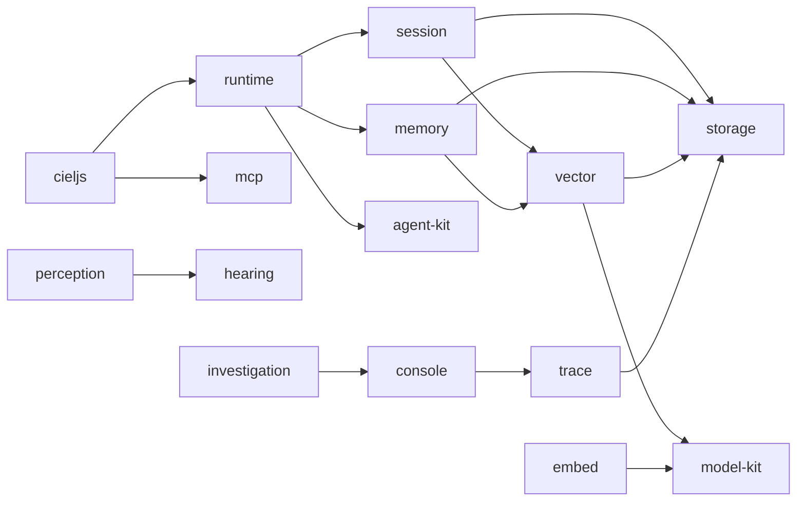

<h1 align="center">Ciel · 夏尔</h1>

<p align="center">一个看直播、而不是开直播的 AI —— 会听、会记，也会自己做出反应的观众。</p>

<p align="center">
  <a href="./README.md">English</a> ·
  <a href="#关于这个项目">关于这个项目</a> ·
  <a href="#仓库里有什么">仓库里有什么</a> ·
  <a href="#架构">架构</a> ·
  <a href="#快速开始">快速开始</a>
</p>

## 关于这个项目

Ciel（夏尔）是我个人在折腾的一个 AI Agent 项目，最开始只是一个挺抽象的想法：既然已经有人在做 AI 主播了，那能不能反过来做一个 **AI DD**？

让 AI 作为一个「观众」去看直播、听主播说话、理解正在发生的事情，也尝试记住过去发生过的一些内容，再根据这些信息做出自己的反应。名字来自《转生史莱姆》里的夏尔，我本身就很喜欢这部「开会番」。

目前 Ciel 主要通过直播画面、语音和已有上下文理解直播，还没有接入弹幕。她也有长期记忆机制，不过目前还不算特别靠谱，可能记不住、想不起来，或者干脆想偏了。所以如果看到她说了一些奇怪、抽象或者容易让人误会的话，大概率只是 AI 理解错了，并不是故意阴阳怪气或者针对谁。

这个项目最后也许并没有什么实际意义，也不一定能变成什么特别有用的东西。我只是挺想看看：如果一个 AI 真的长期作为「观众」存在，最后会变成什么样。目前还在边做边改，如果出现明显不合适或者容易造成误会的内容，也欢迎直接告诉我。

> 最初的项目说明在 B 站：<https://www.bilibili.com/opus/1247491015149879297>

## 仓库里有什么

这个仓库是 Ciel 的核心（core）。「看直播」被拆成若干可以单独使用的包：事实存在哪里、一段对话如何被记住和压缩、长期记忆如何分层、Ciel 看到和听到什么、一次 Agent 运行又如何被追踪和展示。仓库里也有两个应用，但它们是这些包的使用者，不属于核心本身。

- 组合与运行 —— [`cieljs`](./packages/cieljs/README.zh-CN.md)、[`@cieljs/runtime`](./packages/runtime/README.zh-CN.md)
- 记忆与检索 —— [`@cieljs/session`](./packages/session/README.zh-CN.md)、[`@cieljs/memory`](./packages/memory/README.zh-CN.md)、[`@cieljs/vector`](./packages/vector/README.zh-CN.md)、[`@cieljs/embed`](./packages/embed/README.zh-CN.md)
- 看与听 —— [`@cieljs/perception`](./packages/perception/README.zh-CN.md)、[`@cieljs/hearing`](./packages/hearing/README.zh-CN.md)
- 基础设施 —— [`@cieljs/storage`](./packages/storage/README.zh-CN.md)、[`@cieljs/agent-kit`](./packages/agent-kit/README.zh-CN.md)、[`@cieljs/model-kit`](./packages/model-kit/README.zh-CN.md)、[`@cieljs/mcp`](./packages/mcp/README.zh-CN.md)
- 观察她做了什么 —— [`@cieljs/trace`](./packages/trace/README.zh-CN.md)、[`@cieljs/console`](./packages/console/README.zh-CN.md)、[`@cieljs/investigation`](./packages/investigation/README.zh-CN.md)

## 架构



一个 `Storage` 就是一个 PGlite 实例；Session、Memory、Vector 和 Trace 各自把自己的表放在独立的 schema 里。

## 快速开始

需要 Node 24.11+ 与 pnpm，工作区由 [Vite+](https://viteplus.dev/) 的 `vp` CLI 驱动。

```bash
vp install        # 每次拉取代码后
vp run ready      # 格式化、检查、类型检查、测试并构建全部内容
vp run -r test    # 只跑测试
vp run -r build   # 只做构建
```

运行应用：

```bash
vp run @cieljs/blive-agent#dev  # Electron 桌面应用
vp run @cieljs/chorus#dev       # 语音聊天参与者
```

## 文档

没有独立的文档站点：每个包的 README 就是它的文档，而且都有两份——`README.md`（英文）和 `README.zh-CN.md`（中文）。
