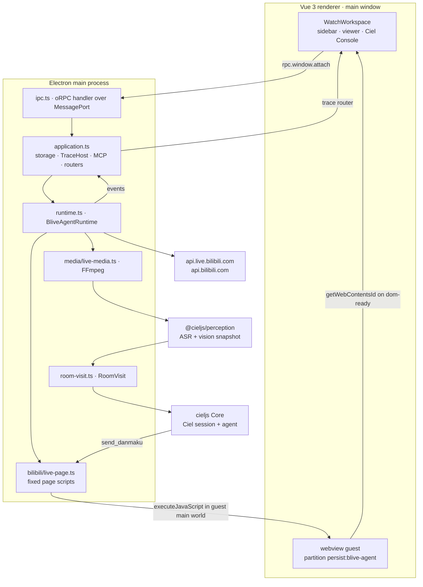
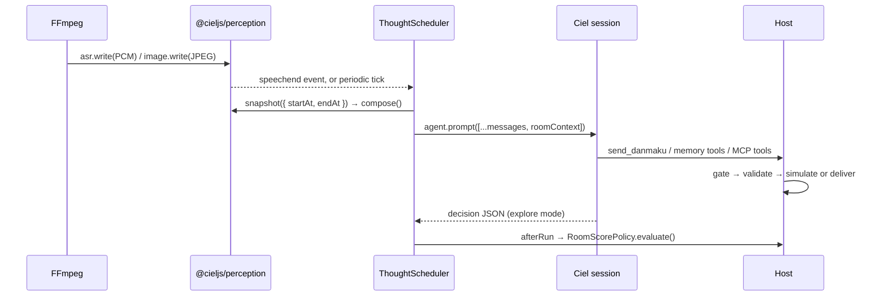

<h1 align="center">@cieljs/blive-agent</h1>

<p align="center">一个看 B 站直播的 Electron 桌面 Agent：理解直播现场，然后在弹幕里自然接话。</p>

<p align="center">
  <a href="./README.md">English</a> ·
  <a href="#概览">概览</a> ·
  <a href="#工作原理">工作原理</a> ·
  <a href="#环境要求">环境要求</a> ·
  <a href="#安装与配置">安装与配置</a> ·
  <a href="#运行">运行</a> ·
  <a href="#观看直播">观看直播</a> ·
  <a href="#关键词唤醒">关键词唤醒</a> ·
  <a href="#声纹">声纹</a> ·
  <a href="#弹幕">弹幕</a> ·
  <a href="#录播与视频模式">录播</a> ·
  <a href="#investigation-调查">Investigation</a> ·
  <a href="#ciel-console-与-trace">Ciel Console</a> ·
  <a href="#架构与目录">架构</a> ·
  <a href="#开发">开发</a> ·
  <a href="#已知限制与未定决策">已知限制</a>
</p>

## 概览

`@cieljs/blive-agent` 把真实的 B 站直播页嵌进 Electron `<webview>`，把直播间的声音和画面送进 [@cieljs/perception](../../packages/perception/README.zh-CN.md)，再让 Ciel Agent 一边看、一边记、一边通过 `send_danmaku` 接话。

三种观看模式：`follow` 只看一个房间，`explore` 让 Agent 从分区里的真实候选中挑房间，`recording` 分析视频或录播而且完全不发弹幕。

不管跑哪种模式，Agent 都只负责提建议。它起草弹幕、挑候选、给房间打分；候选归属校验、切房、开房与重试都由宿主掌握，因此 `send_danmaku` 既不能停止会话，也不能自己触发切房。

真实副作用默认关闭：弹幕走 `simulate`，只有显式给出 `danmakuDelivery: 'live'` 并登录 B 站，才会真的动到站点。

应用是站在本仓库肩上搭起来的：Agent 用 [cieljs](../../packages/cieljs/README.zh-CN.md) Core，听觉与视觉用 [@cieljs/perception](../../packages/perception/README.zh-CN.md)，ASR、KWS 与声纹用 [@cieljs/hearing](../../packages/hearing/README.zh-CN.md)，控制台用 [@cieljs/console](../../packages/console/README.zh-CN.md)，执行记录用 [@cieljs/trace](../../packages/trace/README.zh-CN.md)，持久化用 [@cieljs/storage](../../packages/storage/README.zh-CN.md)，MCP 工具用 [@cieljs/mcp](../../packages/mcp/README.zh-CN.md)。

## 工作原理



guest 页面和感知媒体是刻意分开的。登录、导航和弹幕只存在于 `<webview>` 里；Agent 的音频和画面来自独立的 FFmpeg 进程，因此不依赖页面导出 PCM 或截图。



**一次观看就是一个 `RoomVisit`。** 一次访问拥有房间元数据、本房间的 generation、FFmpeg 子进程、`Perception` 实例、该房间的 `CielSession`、思考调度器、感知事件订阅，以及本次访问真实发出的弹幕记录。切房时先关掉旧访问并递增 `visitGeneration`，所以旧音频、旧画面、旧评分和旧弹幕的迟到回调不会污染新房间。

**房间身份与会话身份分开。** [room-session.ts](src/main/agent/room-session.ts) 里两者互不包含，也都不含登录账号，还不受电脑时区影响：

| 身份         | 规则                                      | 示例                                     |
| ------------ | ----------------------------------------- | ---------------------------------------- |
| 房间 Space   | `bilibili:room:{roomId}`                  | `bilibili:room:123`                      |
| 直播 Session | `bilibili:room:{roomId}:{YYYY-MM-DD}`     | `bilibili:room:123:2026-09-06`           |
| 录播 Session | `bilibili:room:{roomId}:recording:{date}` | `bilibili:room:123:recording:2026-09-06` |

日期取进入房间时的 `Asia/Shanghai` 日历日期；录播优先使用用户填写的 `date`。会话按 `crossSpace: true` 打开，来源固定为这三条：

- `bilibili:room:{roomId}`：房间本身。
- `bilibili:streamer:{streamerUid}`：跨改名稳定，是关联同一主播 Session 与 Memory 的主来源。
- `bilibili:streamer-name:{encodeURIComponent(streamerName)}`：人类可读的别名来源，可按昵称检索。

标题、简介和分区会经常变，所以它们不作为来源，只进每轮的房间上下文。

**状态机。** `WatchStatus` 是可辨识状态，不是一组可能互相矛盾的布尔值；每次变化都通过 `onEvent` 发布。

| 状态             | 含义                                    |
| ---------------- | --------------------------------------- |
| `idle`           | 没有任务，可以选模式。                  |
| `starting`       | `start()` 已接受，正在准备账号与 Ciel。 |
| `awaiting-login` | 请求真实弹幕但还没登录。                |
| `exploring`      | 正在查询分区并请 Agent 选候选。         |
| `opening`        | 正在导航 guest、等待就绪、打开会话。    |
| `watching`       | 媒体、感知和思考循环都在跑。            |
| `stopping`       | 正在释放资源（录播时是在整理总结）。    |
| `closed`         | `close()` 已完成，实例不能再启动。      |

## 环境要求

| 依赖          | 说明                                                                                                        |
| ------------- | ----------------------------------------------------------------------------------------------------------- |
| Node.js       | `>=24.11.1`，取自仓库根 `engines`。                                                                         |
| pnpm          | `12.4.1`，根与应用清单都声明了 `packageManager`，根还有 `devEngines.packageManager`（`onFail: download`）。 |
| Vite+（`vp`） | 工作区工具链，作为根 devDependency 安装，用 `vp run <task>` 跑本应用的任务。                                |
| FFmpeg        | 三种模式都需要。查找顺序：配置里的 `ffmpegPath` → 环境变量 `FFMPEG_PATH` → `PATH` 上的 `ffmpeg`。           |
| B 站账号      | 只在真实弹幕（`danmakuDelivery: 'live'`）时需要。`simulate` 不登录也能跑，登录在应用内嵌页面完成。          |
| ASR 模型      | 从侧栏按需下载到 `<dataDir>/models`。默认 `qwen3-asr-1.7b-int8`，可选 `sensevoice-small`。                  |
| 其他模型      | 首次启用唤醒会自动下载 KWS 模型；声纹需要说话人模型，它包含在 ASR 模型文件集里。                            |

> [!NOTE]
> 应用不会从环境变量读取模型 API key，它只来自 `config.json`。

## 安装与配置

在仓库根安装：

```bash
vp install        # 或：pnpm install
```

应用从 `<dataDir>/config.json` 读取配置，`dataDir` 的确定方式是：

| 场景                          | 数据根目录                                                       |
| ----------------------------- | ---------------------------------------------------------------- |
| 设置了 `BLIVE_AGENT_DATA_DIR` | 该目录（优先级最高）                                             |
| 打包后运行                    | `~/.ciel`                                                        |
| 开发运行                      | `<process.cwd()>/.ciel`，仓库里已有一份 `apps/blive-agent/.ciel` |

本目录的 `config.example.json` 就是最小模板。复制到 `<dataDir>/config.json`，填上 `ai.apiKey` 即可。完整形状如下，每一项和默认值都来自实际的 Zod schema：

```json
{
  "ai": {
    "provider": "xiaomi",
    "model": "mimo-v2.5",
    "apiKey": "your-api-key",
    "baseUrl": "https://api.xiaomimimo.com/v1",
    "thinkingLevel": "off"
  },
  "interaction": {
    "minimumThinkIntervalMs": 2000,
    "periodicObservationMs": 10000,
    "thinkTimeoutMs": 60000
  },
  "wake": {
    "keywords": ["夏尔"],
    "minWaitMs": 1500,
    "maxWaitMs": 4000,
    "cooldownMs": 15000
  },
  "ffmpegPath": "C:/Tools/ffmpeg/bin/ffmpeg.exe"
}
```

| 键                                   | 类型 / 范围                                                           | 默认值                                  | 含义                                                                                           |
| ------------------------------------ | --------------------------------------------------------------------- | --------------------------------------- | ---------------------------------------------------------------------------------------------- |
| `ai.provider`                        | 非空字符串                                                            | **必填**                                | 在 `@cieljs/model-kit/models` 注册的 provider id。                                             |
| `ai.model`                           | 非空字符串                                                            | **必填**                                | 模型 id，`provider` + `model` 必须是已注册的组合。                                             |
| `ai.apiKey`                          | 非空字符串                                                            | **必填**                                | 对应 provider 的凭据。                                                                         |
| `ai.baseUrl`                         | 以 `http://` 或 `https://` 开头的 URL                                 | 省略则使用模型注册的地址                | 只覆盖请求地址，`provider`、`model` 与接口协议都不变；服务要求的路径前缀（例如 `/v1`）要保留。 |
| `ai.thinkingLevel`                   | `off` \| `minimal` \| `low` \| `medium` \| `high` \| `xhigh` \| `max` | 省略则沿用模型默认                      | 推理强度，在房间会话首次请求前写入。                                                           |
| `interaction.minimumThinkIntervalMs` | 整数 ≥ 500                                                            | `2000`                                  | 两轮思考之间的最小间隔。                                                                       |
| `interaction.periodicObservationMs`  | 整数 ≥ 1000                                                           | `10000`                                 | 周期观察间隔，保证没人说话的直播间也会被回看。                                                 |
| `interaction.thinkTimeoutMs`         | 整数 ≥ 1000                                                           | 省略表示不限制                          | 单轮思考的时间预算，超时就中止本轮。                                                           |
| `wake`                               | `false`，或一个对象                                                   | `{}`，即按默认值启用                    | `false` 关闭唤醒检测。                                                                         |
| `wake.keywords`                      | 非空字符串数组                                                        | `["夏尔"]`                              | 唤醒词。                                                                                       |
| `wake.minWaitMs`                     | 整数 ≥ 0                                                              | `1500`                                  | 命中后至少再收这么久的话再思考。                                                               |
| `wake.maxWaitMs`                     | 整数 ≥ 0，且不小于 `minWaitMs`                                        | `4000`                                  | 唤醒等待上限。                                                                                 |
| `wake.cooldownMs`                    | 整数 ≥ 0                                                              | `15000`                                 | 该窗口内的重复命中会被合并。                                                                   |
| `ffmpegPath`                         | 非空字符串                                                            | 省略则用 `FFMPEG_PATH`，再退回 `ffmpeg` | FFmpeg 可执行文件。                                                                            |

每次读取都会校验：文件不存在、JSON 解析失败或 schema 不合法时，都会给出逐条列出问题路径的消息，侧栏会显示配置路径和这条消息。`interaction` 与 `wake` 都可以整段省略。

> [!NOTE]
> `BliveAgentRuntime` 在首次创建时就固定了选项，所以 `ai.*`、`interaction.*`、`wake` 和 `ffmpegPath` 的修改要重启应用才生效。侧栏每秒重读一次配置文件，配置错误和模型文件缺失会即时显示出来。

### 数据目录

`prepareWatchResources()` 在 Electron ready 之前创建并指向这些位置：

| 路径           | 内容                                                                                               |
| -------------- | -------------------------------------------------------------------------------------------------- |
| `config.json`  | 上面的 AI 凭据与运行参数。                                                                         |
| `hearing.json` | 选中的 ASR 模型（`{ "model": "qwen3-asr-1.7b-int8" }`），单独保存，切换模型不会重写凭据。          |
| `mcp.json`     | [@cieljs/mcp](../../packages/mcp/README.zh-CN.md) 读取的 MCP server 配置，其中的工具会交给 Agent。 |
| `storage/`     | 一个 PGlite 数据库，注册 session、memory、vector 和 trace 模块。                                   |
| `models/`      | ASR、VAD、说话人模型与 KWS 模型（唤醒模型在 `models/kws/…`）。                                     |
| `voiceprints/` | `*.voiceprint` 声纹文件。                                                                          |
| `cache/`       | 下载缓存。                                                                                         |
| `logs/`        | 应用日志（`app.setAppLogsPath`）。                                                                 |
| `electron/`    | Electron 会话与 profile 数据（`app.setPath('sessionData')`），包含持久化的 B 站 Cookie。           |

启动时会迁移 `<app path>/.ciel` 和 `<userData>/.ciel` 里的数据：`session`、`memory`、`investigation`、`trace` 与 `mcp.json` 只在目标不存在时复制；`models`、`voiceprints`、`cache` 逐文件补齐，绝不覆盖已有文件。开发环境还会额外复制 `@cieljs/hearing` 旁边随包提供的 `models` 与 `voiceprints`。

## 运行

在仓库根执行：

```bash
vp run @cieljs/blive-agent#dev     # Electron 桌面应用（仓库根 README 也记录了这条）
```

[vite.config.ts](vite.config.ts) 里定义的其他任务：

| 命令                                                                   | 作用                                                             |
| ---------------------------------------------------------------------- | ---------------------------------------------------------------- |
| `vp run @cieljs/blive-agent#dev`                                       | `vld dev`，依赖 `build`；渲染进程热更新，主进程与 preload 重启。 |
| `vp run @cieljs/blive-agent#start`                                     | `vld preview`，不带开发服务器运行构建产物。                      |
| `vp run @cieljs/blive-agent#build`                                     | `vld build`，依赖 `typecheck`。                                  |
| `vp run @cieljs/blive-agent#typecheck`                                 | node 侧 `tsc` 加 web 侧 `vue-tsc`。                              |
| `vp run @cieljs/blive-agent#build:unpack`                              | 用 `electron-builder --dir` 产出免安装目录。                     |
| `vp run @cieljs/blive-agent#build:win` / `#build:mac` / `#build:linux` | 用 `electron-builder` 产出安装包。                               |

打包后由 `BrowserWindow` 加载本地渲染产物，不为界面启动 HTTP 服务。

首次运行按顺序来：创建 `config.json`（没建之前侧栏会显示缺失路径）→ 在侧栏下载听觉模型 → 需要的话登录 B 站 → 选模式、填房间号或分区，点「开始观看」。

## 观看直播

| 界面文案                    | `mode`                                                                                               | 字段                                 | 行为                                                                     |
| --------------------------- | ---------------------------------------------------------------------------------------------------- | ------------------------------------ | ------------------------------------------------------------------------ |
| 单推 · 只看这位主播         | `{ "type": "follow", "roomId": number }`                                                             | 房间号                               | 只看这一个房间并互动。不评分、不切房；即使模型建议离开，宿主也直接忽略。 |
| DD 模式 · 发现感兴趣的直播  | `{ "type": "explore", "areaId": number }`                                                            | 直播分区                             | Agent 从真实候选里挑房间，宿主在评分策略认可后才可能切房。               |
| 视频模式 · 总结、分析和记忆 | `{ "type": "recording", "roomId": number, "source": {…}, "date": "YYYY-MM-DD"?, "prompt": string? }` | 见 [录播与视频模式](#录播与视频模式) | 完全不碰弹幕。                                                           |

两种直播模式都接受 `danmakuDelivery: 'simulate' | 'live'`，界面上对应「真实发送弹幕」复选框，默认是 `simulate`。

**单推模式。** `start()` 用 `BilibiliApi.room(roomId)` 解析房间、打开访问，然后一直看到用户停止。房间不会被换成别的；一旦下播，观看就直接结束，运行状态回到 `idle`，由用户再次开始。界面收的是数字「直播间 ID」，也就是房间号，不是主播 UID。

**探索模式。**

```text
查询分区候选（每页 20 个，按在线人数排序）
        ↓
剔除当前房间，以及仍在冷却期内的房间
        ↓
由 Agent 的 Investigation 选中一个候选
        ↓
宿主校验该房间确实在本轮候选里
        ↓
打开 RoomVisit → 观察 / 互动 / 评分
        ↓
宿主评分策略判定切房？ ── 是 ──▶ 关闭访问 → 重新查询候选
                        └─ 否 ──▶ 继续观看
```

- 候选来自 `room/v3/area/getRoomList`，参数为 `page_size=20&sort_type=online`；Agent 的答案按 `{ roomId, reason }` 解析，`roomId` 不在本轮候选里就直接拒绝。
- **冷却由宿主硬性保证：** 每一次离开（切房、下播、停止、打开失败）都会登记房间，`ROOM_REVISIT_COOLDOWN_MS` 为 30 分钟。冷却中的房间根本不会进候选，模型就算选中也会被归属校验挡下。
- 如果冷却会把候选清空，就放宽：仍然排除当前房间，其余按离开时间从早到晚交回给模型，并在问题里说明本分区没有别的候选。
- 选房失败只报错。房间、会话和媒体原样不动，由下一轮评分再决定是否切房，不做无限工具循环。

**评分。** 探索模式里 Agent 每轮以 JSON 决策收尾，由 `RoomDecisionSchema` 校验：

```ts
{
  action: 'stay' | 'explore',
  confidence: 0..1,
  danmakuAction: 'send' | 'defer',
  evidence: string[],   // 最多 5 条
  reason: string,
  score: 0..100         // 对「继续观看」的兴趣，不是对主播水平的评价
}
```

格式不对时会摘掉工具重问一次，所以纠正轮不会再发弹幕或产生其他副作用；仍然不合法就记为一次错误，本轮不产生房间评分。

`RoomScorePolicy` 是一个无 I/O 的纯对象，把评分流变成切房裁决：

| 规则                                                                   | 结果                              |
| ---------------------------------------------------------------------- | --------------------------------- |
| `score >= 60`                                                          | 清空低分窗口，继续观看。          |
| `action: 'explore' && confidence >= 0.85 && score <= 50`               | 立即切换（`confirmed-explore`）。 |
| 最近两轮都 `score <= 20`                                               | 切换（`sustained-low-score`）。   |
| 最近两轮都满足 `action: 'explore' && score <= 50 && confidence >= 0.7` | 切换（`confirmed-explore`）。     |
| 最近三轮平均分 `<= 40`，且至少两轮 `confidence >= 0.6`                 | 切换（`sustained-low-score`）。   |

进入房间后的 `ROOM_REVIEW_AFTER_MS`（45 秒）内完全不允许切换。客观终止——页面报下播、房间结束、媒体连续失败——不必等这个门槛。

### 检测下播

每次访问独占一个 `LiveStatusMonitor`（`main/bilibili/live-status-monitor.ts`）。检查是串行的：下一次检查在上一次结束后 5 秒才安排，两次检查不会重叠。

先问页面。通过 guest 页面读取 `window.livePlayer.getPlayerInfo().liveStatus`：`0`（未开播）和 `2`（轮播）都不算实时直播，只有 `1` 会直接结束检查；状态未知、播放器缺失或页面报错时，改用 `BilibiliApi.room()` 的 `room.live`。

媒体退出不能只信页面。`mediaStopped()` 在 FFmpeg 正常 EOF 和异常退出时都会触发，这条路径直接查 API，因为播放器可能仍缓存着 `live`。如果媒体退出的通知在页面查询期间才到达，会补一次 API 核实再下结论。

确认下播就结束访问。监视器自行关闭，整个访问被释放（Session、媒体、感知、订阅）；探索模式随后重新选房，单推模式下观看结束、运行状态回到 `idle`。无法确认下播的媒体退出同样释放访问，并报告媒体错误（状态查询也失败时是「媒体已退出，且无法确认直播状态」）。而单纯的状态查询失败不等于下播：访问会保留，错误被上报，下一次检查继续重试。

结束访问是有顺序的。运行状态先切到 `stopping` 并取消访问——这会禁止后续弹幕并中止仍在思考的 Agent——然后才排队释放资源，所以下播之后不会再发出任何内容。停止或切房会关闭监视器、中止进行中的检查并丢弃迟到结果，因此旧房间的检查永远不会关掉替代它的新房间。

## 关键词唤醒

直播音频同时送给 ASR **和**一个独立的唤醒检测器，唤醒不会给识别做门控。启用唤醒时（`wake` 省略或给对象），首次使用会把 KWS 模型下载到 `<dataDir>/models/kws/…`。

命中唤醒只做一件事：让下一轮更早思考。调度器至少等 `minWaitMs`（1500 毫秒）收后续话语，语音一结束就优先开跑，最多等到 `maxWaitMs`（4000 毫秒）；如果已经有思考在跑，就等它结束。`cooldownMs`（15000 毫秒）以内以及同一次待处理唤醒里的重复命中都会被合并。

- 被叫到不等于要马上开口：唤醒那轮的上下文里带着关键词、音频时间和明确的「不要抢着发言」提示，发不发仍然由弹幕规则决定。
- 唤醒记录会以「关键词唤醒」消息出现在 Ciel Console 里。
- `wake: false` 关闭检测器。录播不会启用唤醒；切房或停止会取消待处理的唤醒。
- `maxWaitMs` 只是宿主侧的调度上限，它不保证 ASR 已经转写完，也不保证模型已经返回。

## 声纹

声纹就是普通文件：每个 `<dataDir>/voiceprints/*.voiceprint` 都会变成一个说话人档案，名字就是去掉后缀的文件名，所以 `弥生.voiceprint` 在识别结果里显示为「弥生」。

- 每次创建 `Perception` 实例都会重新扫描目录，也就是每次打开房间都会扫；新增、改名或删除文件后重新开始观看即可。
- `voiceprints` 目录不存在就是不加载任何声纹；文件损坏会让听觉初始化报错。
- 声纹需要说话人模型，它包含在 ASR 模型文件集里。

## 弹幕

Agent 唯一能改动站点的工具是 `send_danmaku`，用 TypeBox 定义参数：

```ts
const SendDanmakuSchema = Type.Object({
  action: Type.Union([Type.Literal('send'), Type.Literal('defer')]),
  content: Type.String({ maxLength: 40 }),
  reason: Type.String({ minLength: 1 }),
});
```

[agent/tools.ts](src/main/agent/tools.ts) 里的执行顺序：

```text
schema validated
      ↓
action = defer ──▶ emit danmaku_deferred → return { status: 'deferred', reason }
      ↓ send
gate：每轮最多一次 send_danmaku
      ↓
canSend()：状态是 watching，且本轮 signal 没被中止
      ↓
房间存在 → trim → 非空 → 与本次访问已发送内容规范化去重
      ↓
delivery = simulate ──▶ emit danmaku_simulated → return { status: 'simulated', content }
      ↓ live
LivePage.sendDanmaku(content)：readiness 必须是同一个 roomId，generation 未变
      ↓
由页面 POST https://api.live.bilibili.com/msg/send
      ↓
accepted = code === 0 && !riskControl
      ↓
emit danmaku_delivered + 记入本次访问的已发送历史
```

- **只有 `delivered` 代表发出去了。** `deferred` 和 `simulated` 都不会假装送达，也只有 `delivered` 会写进「已真实发送的弹幕」那段上下文。
- 去重会统一大小写并去掉空白、标点和符号，所以同一瞬间的近义改写会被拒绝。
- 页面脚本直接调站点自己的发送接口，Cookie 和 `Referer` 由浏览器带上，`csrf` 取自页面可读的 `bili_jct`。表单字段：`msg`、`roomid`、`csrf_token`、`csrf`、`bubble=0`、`color=16777215`、`fontsize=25`、`mode=1`、`rnd`。
- **风控按拒绝处理。** 光看 `code === 0` 不够：等于 `f`，或含「风控 / 风险 / 频繁 / 系统繁忙 / 稍后再试 / 安全校验 / 验证码 / 人机验证」的响应都会报错，并且不会重试。
- 工具返回是 Agent 可以依赖的可辨识联合：

```ts
type DanmakuToolResult =
  | { status: 'deferred'; reason: string }
  | { status: 'simulated'; content: string }
  | { status: 'delivered'; content: string; roomId: number };
```

提示词侧约束表达：「简短、口语、有现场感的中文」，优先 4～14 个字，硬上限 40 字符；称呼自然时用主播昵称；每条最多一个白名单表情，唱歌或刚唱完允许纯 `[喝彩]`。当前白名单在 [prompts/modes.ts](src/main/prompts/modes.ts)：

```text
[dog] [花] [妙] [哇] [爱] [比心] [赞] [滑稽] [吃瓜] [笑哭] [捂脸] [喝彩] [偷笑] [大笑] [惊喜]
[问号] [鼓掌] [大哭] [呆] [流汗] [生气] [加油] [害羞] [抱抱] [摊手] [抱拳] [给力] [耶]
```

## 录播与视频模式

视频模式把在线地址或本地文件交给 FFmpeg，而不是走直播页面。它创建一个没有直播页面参与的访问，并且完全不发弹幕。

| 字段     | 说明                                                                                                                                                                                          |
| -------- | --------------------------------------------------------------------------------------------------------------------------------------------------------------------------------------------- |
| 房间号   | 必填。用于 space/session 身份和事件展示，即使视频本身不是直播间。                                                                                                                             |
| 来源     | `{ "type": "url", "url": "https://…" }`——任何 FFmpeg 能读的 HTTP(S) 或流地址——或 `{ "type": "file", "path": "…" }`，由文件对话框选出，过滤 `mp4`、`mkv`、`mov`、`webm`、`flv`、`m4v`、`avi`。 |
| `date`   | 可选 `YYYY-MM-DD`，替换会话里的进入日期。必须是真实存在的日历日期。                                                                                                                           |
| `prompt` | 可选的场景说明，作为背景注入系统提示词。实际发生了什么仍然以画面和语音为准。                                                                                                                  |

和直播访问的区别：

- 完全不创建弹幕工具，所以这个模式不能发送、模拟或建议发送弹幕。
- FFmpeg 不带直播重连参数，改用 `-progress pipe:2 -nostats` 以便解析进度；`video_progress` 会依次报告 `extracting`、`recognizing`、`analyzing`，并带上已处理秒数与总秒数。
- 画面时间戳跟随媒体时间（`imageCount × 60000/9`）而不是墙上时钟，所以加速抽取不会把每一帧挤进同一个时间窗口。
- 感知保留时间设为 `Date` 能表示的最大值，整段视频在被总结前都还能读到。
- ASR 转写会以「视频语音 · mm:ss」的消息记入执行记录，录播里说过的话可以在 Ciel Console 里回看。
- 自然播完会发 `recording_finished`，然后请求完整总结；点「停止并总结」走 `finishRecording(signal, true)`，请求的是一份必须声明自己不完整的部分总结。崩溃或中止只释放资源——没看完的视频绝不会被总结成看完了。

## Investigation 调查

顶栏的 Investigation 按钮会打开独立窗口（`?view=investigation`），里面跑 [@cieljs/investigation](../../packages/investigation/README.zh-CN.md) 的 `InvestigationChat`，并挂两个自己的 oRPC router：`investigation` 负责会话管理，`investigationTrace` 只提供调查会话的执行记录。

- 会话目标可以是 `{ "type": "global" }` 或某个房间；房间目标会变成 `{ spaceId: 'bilibili:room:{roomId}' }` 加该房间的来源，并在该房间正在观看时接上当前直播会话 id。
- 会话 id 形如 `investigation:global:<uuid>` 和 `investigation:room:<roomId>:<uuid>`；重开窗口时会从执行记录里恢复。
- 提问执行 `ciel.investigate({ sessionId, target, question, memoryAccess: 'read-write', crossSpace: true, sources })`，所以调查会话可以跨空间读取，也可以给它的目标写记忆。
- 标题先是根据提问生成的临时值，随后被模型生成的标题替换（最多 48 个字符，会去掉引号与标点），也可以手动改名。
- 同一会话同时只处理一个问题：上一条还在跑时新问题会被拒绝，`abort` 可以取消正在跑的那条。

探索模式的选房用的是另一套刻意隔离的 Investigation：目标 `{ type: 'global' }`、`crossSpace: true`、来源只有 `['bilibili:area:{areaId}']`、使用探索专用系统提示词，没有记忆写权限，也没有弹幕工具。候选写在问题正文里，答案由宿主校验。

## Ciel Console 与 trace

右侧栏就是 [@cieljs/console](../../packages/console/README.zh-CN.md)，接在 `trace` router 上，并带上当前房间会话 id：

```vue
<CielConsole
  :client="rpc.trace"
  :session-id="activeSessionId"
  :auto-scroll="active"
  :tool-renderers="toolRenderers"
  :message-renderers="messageRenderers"
/>
```

- 左右侧栏都能折叠、拖动调宽，画面区占剩下的空间。左侧栏放账号控制、运行配置（配置状态与 ASR 模型下载/切换）、观看设置，以及滚动保留最近 60 条的事件时间线。
- `TraceHost.open({ storage, awaitReplay: false })` 把历史重放留在后台，不排在启动路径上。每个运行时事件都通过 `trace.record(event.type, event)` 记入，并作为 bridge 事件转发给渲染进程。
- 工具调用有专门的渲染组件，不直接摆原始 JSON：`send_danmaku`、`get_streamer_dynamics`、`get_streamer_videos`。
- 带 `action` 和 `score` 的 assistant JSON 会渲染成房间决策卡片。
- 顶栏的压缩按钮调用 `runtime.compactContext()` → `visit.session.compact()`，并如实报告本轮有没有产生新的压缩摘要。
- `trace` router 排除 id 以 `investigation:` 开头的会话，它们归 `investigationTrace`，所以观看控制台只会显示观看会话。

## 架构与目录

```text
apps/blive-agent/
  config.example.json      最小 config.json 模板
  vite.config.ts           本应用的 Vite+ 任务（dev / build / typecheck / 打包）
  build/                   electron-builder 图标与 macOS entitlements
  resources/icon.png
  src/
    main/
      index.ts                     Electron 生命周期、窗口、guest 加固、退出
      application.ts               storage、TraceHost、MCP、router、运行时生命周期
      ipc.ts                       MessagePort 接入、sender 校验、回收
      runtime.ts                   BliveAgentRuntime：状态机、模式策略、资源所有权
      room-visit.ts                一次访问：感知 + 媒体 + 会话 + 调度器
      room-score-policy.ts         纯函数式的多轮切房策略
      room-history.ts              30 分钟冷却与候选过滤
      browse-window.ts             单例 B 站浏览窗口
      investigation-window.ts      Investigation 窗口及其 sender 校验
      config.ts                    配置 schema、数据目录、资源迁移
      hearing-settings.ts          与配置分开保存的 ASR 模型选择
      voiceprints.ts               *.voiceprint 扫描
      resources.ts                 只补不覆盖的迁移助手
      shutdown.ts                  有序、全部结算的关闭协调
      user-agent.ts                全局共用的桌面 Chrome User-Agent
      agent/
        ciel.ts                    defineCiel：模型、提示词、工具、调查提示词
        tools.ts                   send_danmaku 与每轮闸门
        decisions.ts               RoomSelection / RoomDecision schema 与解析
        exploration.ts             候选查询、冷却过滤、调查调用
        room-session.ts            房间 space、按日期的 session、来源
        streamer-tools.ts          get_streamer_dynamics / get_streamer_videos
      bilibili/
        api.ts                     分区、房间、候选、播放地址、动态、投稿
        live-page.ts               guest 归属、导航、登录、就绪、弹幕
        page-executor.ts           类型安全的 executeJavaScript 与 URL 白名单
        page-scripts.ts            在 guest 里运行的固定脚本
        send-danmaku.ts            站点发送接口调用与风控判定
        live-status.ts             先问页面，再用 API 核实
        live-status-monitor.ts     周期性的下播 / 媒体失败检测
        wait-for-page.ts           带独立超时的轮询助手
      media/live-media.ts          FFmpeg 生命周期、PCM/JPEG 拆包、进度解析
      prompts/                     人设、直播规则、模式规则、房间上下文、
                                   感知上下文、表情白名单
      routes/                      account/watch/setup/recording/window 的 oRPC 路由
      scheduling/
        thought-scheduler.ts       单飞思考、合并、间隔、超时
        wake.ts                    唤醒选项与唤醒上下文
    preload/index.ts               把 MessagePort 交给主进程
    renderer/                      Vue 3 外壳：App.vue、rpc.ts、components、
                                   composables、theme
    shared/
      types.ts                     WatchMode、StartWatchOptions、RoomInfo、WatchEvent……
      ipc.ts                       bridge 类型（oRPC 客户端契约）
      schemas.ts                   主进程与渲染进程共用的 TypeBox schema
```

| 模块                                      | 职责                                                                                               |
| ----------------------------------------- | -------------------------------------------------------------------------------------------------- |
| `main/runtime.ts`                         | 状态机、单推/探索/录播策略、`RoomVisit` 所有权、串行化的启动/切房/停止。                           |
| `main/application.ts`                     | 只开一次数据库，持有 TraceHost、MCP、直播页面与运行时，并组装 router。                             |
| `main/ipc.ts`                             | 同步登记 MessagePort 通道、校验 sender、导航时释放端口。                                           |
| `main/bilibili/live-page.ts`              | 持有 guest `WebContents`，让 generation 失效，是唯一驱动页面的入口。                               |
| `main/bilibili/page-executor.ts`          | 把 `executeJavaScript` 包进异步 IIFE，执行超时/取消/generation/URL 检查，并用 TypeBox 校验返回值。 |
| `main/media/live-media.ts`                | 拼 FFmpeg 参数、拆分 PCM 与 JPEG 流、关闭前等待挂起写入。                                          |
| `main/scheduling/thought-scheduler.ts`    | 单飞运行、合并最新待处理、最小间隔、可选超时、唤醒窗口。                                           |
| `renderer/components/LiveRoomWebview.vue` | 保持一个 `<webview>` 常驻挂载，并且只上报一次 `WebContents ID`。                                   |

### 渲染层、样式与登录

- 渲染层是 Vue 3 + Tailwind CSS 4（`@tailwindcss/vite`）。布局放在 SFC 的工具类里，共用控件通过 `@apply` 保留语义类名，Electron 专属的部分——拖拽区域和滚动条——使用原生 CSS。迁移保留了原有色值、间距、字体、折叠布局和交互状态。
- 登录发生在 guest 页面内，宿主只负责观察：`waitForLogin()` 每 1.5 秒轮询页面的 `BilibiliLive.UID`，只有 UID 是明确的非零值才请求账号 API，因此未登录时不会反复打接口。等待 6 分钟后放弃，成功、取消与失败都会清理各自的计时器；拿到账号后直接同步侧栏。

### 安全边界

- 渲染进程从不调用 `executeJavaScript`；页面执行只存在于主进程，且 `code` 永远来自仓库内的固定脚本，不来自模型。
- 动态值在进入脚本前一律 `JSON.stringify`，不做裸字符串拼接。
- 主窗口使用 `contextIsolation: true`、`nodeIntegration: false`、`sandbox: false`（preload 是 ESM）和 `webviewTag: true`。每个被附加的 guest 都被强制 `sandbox: true`、删掉未知 preload，`will-attach-webview` 会拒绝白名单之外的 src。
- 导航与页面执行只允许 `https://bilibili.com` / `https://*.bilibili.com`，外加 `about:blank`。`setWindowOpenHandler` 一律拒绝；guest 里打开的直播间链接会转成 `room_requested` 事件。
- 渲染进程通过 oRPC 走 MessagePort 与主进程通信。preload 只转发同源的 `blive-agent:connect` 消息所带的端口；主进程只接受主窗口主 frame 或 Investigation 窗口主 frame，要求恰好一个端口，并在导航时丢弃连接。
- Agent 够不到 `executePage`，唯一会改站点的工具是 `send_danmaku`。Cookie 只用于登录判断和页面请求，不写日志，不进提示词，也不进 Session 或 Memory。

## 开发

```bash
vp install                       # 安装工作区
vp check                         # 格式化、lint 与类型感知检查
vp test                          # Vitest；根配置把 apps/* 注册为 project
vp run @cieljs/blive-agent#typecheck     # 本应用的 tsc（node）+ vue-tsc（web）
vp run @cieljs/blive-agent#build         # 构建 main、preload 与 renderer
```

`vp run @cieljs/blive-agent#test` 并不存在——本应用没有定义 `test` 任务。测试是与源码同目录的 `*.test.ts`（覆盖配置加载、页面执行、弹幕发送、评分策略、调度器、房间冷却、决策解析、探索选房、会话身份、提示词、退出协调、资源迁移、声纹，以及面向 IPC 的路由），由工作区的 Vitest projects 收进去。

应用的 `package.json` 没有 `scripts` 字段，所有可运行任务都在 [vite.config.ts](vite.config.ts) 里，通过 `vp run @cieljs/blive-agent#<task>` 调用。

> [!TIP]
> 主进程在直播 guest 附加时会打开 DevTools。调页面行为时很方便，日常使用则偏吵。

## 已知限制与未定决策

以下都来自设计阶段，并且在当前代码里依然成立。

送达无法端到端证明。能拿到的最好信号是页面发送接口返回的 `code === 0 && !riskControl`，而响应看起来成功、弹幕却没有出现在直播里是可能的——所以 `delivered` 的含义是「站点没有拒绝」，不是「观众看到了」，真实发送必须用测试账号手工验证。界面上的 `live` 也没有二次确认弹窗：设计文档把这件事留着未定（是否用 `AlertDialog`），所以现在只在复选框旁给一段提示，内部默认仍然是 `simulate`。表情白名单同样只存在于提示词里，代码不校验弹幕中的表情标签，非法标签是在站点侧失败；列表里每个标签是否仍被接受，需要回到真实页面复核。

Electron 侧的加固偏保守，但还不完整。导航白名单接受任意 `https://*.bilibili.com` 页面，而设计文档想要的是登录、主页和直播页的最小域名白名单。guest 权限请求处理器没有安装，现在的依靠是沙箱、白名单和 `setWindowOpenHandler`。`<webview>` 实际设置了 `allowpopups`，与设计文档「不设」的约束相反，实践上靠拒绝所有弹窗、并把形如房间号的 URL 转成 `room_requested` 事件来缓解。

还有一些策略仍开着口，或者只接了一半。单推模式收的是数字房间号而不是主播 UID——`BilibiliApi.roomByStreamer` 存在，但运行时从不调用它——所以主播换了房间号不会被自动跟上。房间冷却留在进程内存里，重启就忘了最近 30 分钟；这是有意的（窗口通常落在一次运行内），但没有持久化。探索用的 Investigation 只拿到 `bilibili:area:{areaId}` 这一个来源，候选房间与主播写在问题正文里，因此无法按来源发现那些房间的 Session 与 Memory。`ai.thinkingLevel` 只在首次请求前写入房间会话，是否还有别的地方要跟着走仍未定。思考节奏也没有调过：配置默认值（最小间隔 2000 毫秒、周期观察 10000 毫秒）比设计文档提出的 20 秒 / 45 秒紧得多，而 `BliveAgentRuntime` 在不带配置直接使用时还会退回 5000 / 30000 毫秒。

重构留下的两处痕迹还在。`.ciel/trace` 目录已经不存在，执行记录与会话、记忆一起放在同一个 PGlite `storage/` 数据库里，这也正是迁移逻辑仍然会去找旧的 `session`、`memory`、`investigation`、`trace` 路径的原因；`shared/ipc.ts` 里还留着一组没人引用的 `BLIVE_AGENT_IPC` channel 名，实际 bridge 是 oRPC router。

最后，B 站页面脚本依赖站点内部实现：`window.livePlayer`、`window.__NEPTUNE_IS_MY_WAIFU__`、`window.BilibiliLive.UID`、`.header-login-entry` 元素和 `bili_jct`。站点改版会直接打断就绪检测、直播状态或弹幕，直到脚本跟着更新。
