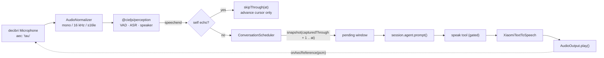

<h1 align="center">@cieljs/voice-agent</h1>

<p align="center">A multi-speaker voice-chat participant for Node.js: always listening, thinking only when it matters, speaking through TTS.</p>

<p align="center">
  <a href="./README.zh-CN.md">简体中文</a> ·
  <a href="#overview">Overview</a> ·
  <a href="#scope--non-goals">Scope &amp; non-goals</a> ·
  <a href="#requirements--install">Requirements / Install</a> ·
  <a href="#quick-start">Quick start</a> ·
  <a href="#run-it">Run it</a> ·
  <a href="#configuration">Configuration</a> ·
  <a href="#how-it-works">How it works</a> ·
  <a href="#directory-layout">Directory layout</a> ·
  <a href="#development">Development</a> ·
  <a href="#unverified-decisions">Unverified decisions</a>
</p>

## Overview

`@cieljs/voice-agent` is a pure Node.js application. It captures audio from a local input device, normalizes it to the fixed 16 kHz / mono / s16le contract, feeds it to [`@cieljs/perception`](../../packages/perception/README.md), hands the resulting multi-speaker snapshots to a Ciel Session (`cieljs` / [`@cieljs/runtime`](../../packages/runtime/README.md)), lets the Agent decide whether to join the conversation, and speaks the reply through Xiaomi MiMo TTS on a selected output device.

| Capability                                 | Implementation                                                                                                                              |
| ------------------------------------------ | ------------------------------------------------------------------------------------------------------------------------------------------- |
| Capture and playback                       | [`decibri`](https://decibri.com) (`Microphone` / `Speaker`), N-API prebuilt binaries                                                        |
| VAD, ASR, speaker labels, frozen snapshots | [`@cieljs/perception`](../../packages/perception/README.md) (audio work delegated to [`@cieljs/hearing`](../../packages/hearing/README.md)) |
| Session, Memory, tools, Agent lifecycle    | `cieljs` over [`@cieljs/runtime`](../../packages/runtime/README.md)                                                                         |
| Scheduling and merge of speech ends        | `ConversationScheduler` (this package)                                                                                                      |
| Deciding _whether_ and _what_ to say       | a single gated `speak` tool (this package)                                                                                                  |
| Speech synthesis                           | Xiaomi `mimo-v2.5-tts` adapter (this package)                                                                                               |

Design invariants:

- At most one `session.agent.prompt()` runs at any moment; `speechend` is the only automatic thinking trigger.
- Every `speechend` produces a frozen, non-overlapping incremental snapshot, so late-arriving speech never mutates the input of a running think.
- The Agent picks the moment; the scheduler decides whether that moment still holds; the host owns synthesis and playback routing.
- Silence is a normal, first-class outcome — it is not a failure and it does not call TTS.

## Scope & non-goals

`@cieljs/voice-agent` deliberately **is not**:

- A browser or desktop UI. No Web Audio, no `setSinkId()`, no permission flows, no runtime visual configuration page — configuration is a typed `voice-agent.config.ts`.
- A question-answering bot that must reply to every detected utterance. `speechend` schedules a _judgement_, not an answer.
- A synchronous ASR → Agent → TTS request pipeline. Intermediate ASR results only enter the perception timeline; they never call the Agent directly.
- A transport for a specific chat platform (Discord, QQ, …). Platform integration is expected later as an outer transport layer and stays outside the perception, thinking and TTS contracts.
- A vision consumer. Voice Agent creates perception with `asr` + `retentionMs` only, so `perception.image` is undefined and only audio is fed in.
- A streaming-ASR or streaming-TTS system. The TTS contract returns complete audio; a `StreamingTextToSpeech` capability detection is explicitly deferred.
- A voice-design or voice-clone front end. MiMo voice design, cloning and singing are not exposed in the generic config.
- A multi-Agent host. One fixed group-chat Session runs at a time, and thinking is single-flight.
- A hand-written AEC/DSP stack. Acoustic echo cancellation comes from the audio backend; Voice Agent only enables it, feeds it a far-end reference and keeps a text-similarity fallback.
- A FIFO playback queue. Replies that have not started playing are superseded by newer speech instead of being queued.
- A hot-swap surface for voiceprints or models at runtime.

## Requirements / Install

| Requirement     | Detail                                                                                                                                                                                           |
| --------------- | ------------------------------------------------------------------------------------------------------------------------------------------------------------------------------------------------ |
| Node.js         | `>=24.11.1` (repo root `engines`)                                                                                                                                                                |
| Package manager | pnpm `12.4.1` (repo root `devEngines.packageManager`)                                                                                                                                            |
| Toolchain       | Vite+ CLI `vp` — scripts are run through `vp run <script>`                                                                                                                                       |
| Native audio    | `decibri` `^5.7.0` (`naudiodon2`, PortAudio, node-gyp and MSVC are **not** used); prebuilt N-API binaries are published for `win32` (x64/arm64), `darwin` (arm64) and `linux` (x64/arm64, glibc) |
| Credentials     | `XIAOMI_API_KEY` (shared by the Agent model provider and the MiMo TTS adapter)                                                                                                                   |
| Real device run | One usable input device and one usable output device                                                                                                                                             |

```bash
# from the repo root
vp install
```

The package is consumed from source inside this monorepo (`@cieljs/voice-agent`, ESM, `exports["."] = ./dist/index.mjs`). No runtime configuration UI exists: everything is expressed in `voice-agent.config.ts` or in the programmatic options.

## Quick start

```ts
import {
  createVoiceAgent,
  defaultVoiceAgentConfig,
  resolveVoiceAgentModel,
} from '@cieljs/voice-agent';

const voiceAgent = createVoiceAgent({
  config: defaultVoiceAgentConfig,
  model: resolveVoiceAgentModel(),
});

const unsubscribe = voiceAgent.onEvent(event => console.log(event));

await voiceAgent.start();

process.on('SIGINT', async () => {
  unsubscribe();
  await voiceAgent.close();
});
```

`resolveVoiceAgentModel()` is a thin wrapper over the model registry — it returns `models.getModel('xiaomi', 'mimo-v2.5')` and throws `未找到 Xiaomi mimo-v2.5 模型` when the registry has no such model. The Xiaomi provider resolves its credential from `XIAOMI_API_KEY`, the same variable the TTS adapter reads.

The CLI entry point in `src/cli/index.ts` does exactly the above with `voice-agent.config.ts` instead of `defaultVoiceAgentConfig`.

### `createVoiceAgent(options)`

| Option       | Type                                   | Notes                                                                                                          |
| ------------ | -------------------------------------- | -------------------------------------------------------------------------------------------------------------- |
| `config`     | `VoiceAgentConfig`                     | Required. Validated by `defineVoiceAgentConfig`.                                                               |
| `model`      | `Model<Api>` (`@earendil-works/pi-ai`) | Required. Passed straight to `defineCiel`.                                                                     |
| `dataDir`    | `string`                               | Defaults to `join(homedir(), '.ciel')`, then `resolve()`d to an absolute path.                                 |
| `input`      | `AudioInput`                           | Optional override — skip the decibri adapter (used by tests and embedders). Device assertions are skipped too. |
| `output`     | `AudioOutput`                          | Optional override, same rules.                                                                                 |
| `tts`        | `TextToSpeech`                         | Optional override. When omitted, the Xiaomi adapter is built and `XIAOMI_API_KEY` becomes mandatory.           |
| `perception` | `Perception`                           | Optional override, so the audio pipeline can be faked deterministically.                                       |

### The returned `VoiceAgent`

| Member              | Behaviour                                                                                                                                                                  |
| ------------------- | -------------------------------------------------------------------------------------------------------------------------------------------------------------------------- |
| `status`            | `'idle' \| 'starting' \| 'running' \| 'closing' \| 'closed'`                                                                                                               |
| `scheduler`         | Current `SchedulerState`; reports `{ status: 'idle' }` while running before the scheduler exists, and `{ status: 'closed' }` otherwise.                                    |
| `start()`           | Resolves immediately when already running, returns the in-flight promise while starting, rejects with `Voice Agent 当前不可用：<status>` from any other state.             |
| `close()`           | Idempotent — repeated calls return the same promise. Closing while starting waits for the start to settle first, then still releases host-owned resources (including MCP). |
| `onEvent(listener)` | Subscribes to `VoiceAgentEvent`; returns an unsubscribe function.                                                                                                          |

Work is placed in `dataDir`: `<dataDir>/storage` (Storage with the session, memory and vector modules), `<dataDir>/models` (ASR/VAD/speaker models consumed by `@cieljs/perception`), `<dataDir>/mcp.json` (MCP config, when `mcp.enabled`).

## Run it

Package scripts (from `package.json`):

| Script           | Command                                  | Purpose                               |
| ---------------- | ---------------------------------------- | ------------------------------------- |
| `dev`            | `oxnode ./src/cli/index.ts start`        | Start the app                         |
| `list-devices`   | `oxnode ./src/cli/index.ts list-devices` | List input/output devices             |
| `start`          | `oxnode ./src/cli/index.ts start`        | Start the app (same command as `dev`) |
| `check`          | `vp check`                               | Format, lint and type check           |
| `prepublishOnly` | `vp run build`                           | Build before publishing               |

> [!NOTE]
> `dev` and `start` run the identical command — there is no watch mode. Use `vp run dev` or `vp run start` interchangeably.

```bash
cd apps/voice-agent

vp run list-devices   # index, stable id, channel counts, default rate for every device
vp run start          # reads voice-agent.config.ts and XIAOMI_API_KEY
```

CLI arguments (`process.argv.slice(2)`):

| Argument                  | Behaviour                                                                                                                                                                                                 |
| ------------------------- | --------------------------------------------------------------------------------------------------------------------------------------------------------------------------------------------------------- |
| `list-devices`, `devices` | Print input devices, then output devices. Each line carries `index`, `name`, `maxInputChannels`/`maxOutputChannels`, `rate` and a `(默认)` marker; the stable `id` is printed on an indented second line. |
| `start`, _(none)_         | Run Voice Agent, then print `Voice Agent 已启动，Ctrl+C 退出。`                                                                                                                                           |
| `help`, `--help`, `-h`    | Print usage.                                                                                                                                                                                              |
| anything else             | Print usage and set `process.exitCode = 2`.                                                                                                                                                               |

Environment:

| Variable          | Effect                                                                                                                                                                                                                                                                                                                    |
| ----------------- | ------------------------------------------------------------------------------------------------------------------------------------------------------------------------------------------------------------------------------------------------------------------------------------------------------------------------- |
| `XIAOMI_API_KEY`  | Required by `start` unless a `tts` override is injected. Used as a Bearer token by the MiMo TTS adapter and by the Xiaomi model provider. It is read from `process.env` only and is never written into config files, logs, error details or the Session. A missing key fails startup with `缺少 XIAOMI_API_KEY 环境变量`. |
| `.env` (optional) | The CLI calls `process.loadEnvFile()` before parsing arguments; a missing file is ignored silently, so real environment variables still win.                                                                                                                                                                              |
| `NO_COLOR`        | Disables ANSI colours. Colours are also disabled automatically when stdout is not a TTY.                                                                                                                                                                                                                                  |

> [!WARNING]
> Xiaomi's public examples commonly use `MIMO_API_KEY`. This project reads **only** `XIAOMI_API_KEY` as a project convention.

The CLI renders events as Chinese-labelled lines — `识别` (transcript + speaker), `忽略` (self-echo), `思考` (segment count, then spoke/silent + duration), `工具` (tool call and result), `朗读` (text, then synthesis time), `播放` (device selector, then duration) and `错误` (stage + message on stderr). `SIGINT` and `SIGTERM` trigger `voiceAgent.close()` and `process.exit(0)`; further signals are ignored once shutdown started.

## Configuration

Configuration is a typed module: `defineVoiceAgentConfig()` validates and returns the object, and `defaultVoiceAgentConfig` is the built-in baseline.

```ts
// apps/voice-agent/voice-agent.config.ts
import { defaultVoiceAgentConfig, defineVoiceAgentConfig } from '@cieljs/voice-agent';

export default defineVoiceAgentConfig({
  embedding: defaultVoiceAgentConfig.embedding,
  mcp: {
    enabled: true,
  },
  audio: {
    input: {
      sampleRate: 48_000,
      channels: 1,
      // device: 4,
    },
    output: {
      // device: 2,
    },
  },
  conversation: {
    spaceId: 'voice-chat',
    sessionId: 'local-group',
    sources: ['voice-chat:local-group'],
    minimumThinkIntervalMs: 200,
  },
  perception: {
    asr: {
      speaker: [],
      speakerThreshold: 0.6,
      maxSpeakers: 8,
    },
    retentionMs: 60_000,
  },
  tts: {
    provider: 'xiaomi',
    model: 'mimo-v2.5-tts',
    voice: '冰糖',
    format: 'wav',
    instructions: '自然、轻松，像正在和熟人聊天；语速适中。',
  },
});
```

`defaultVoiceAgentConfig` differs from the shipped file in two places: `embedding.cacheDir` is `join(homedir(), '.ciel', 'cache', 'embedding')` (the file reuses that default) and `conversation.minimumThinkIntervalMs` is `2_000` (the file uses `200`).

### `embedding`

When `embedding` is present, Voice Agent creates a `VectorService` backed by `qwen(config.embedding)` with `providerId: 'qwen'`, `revision: '1'`, `granularity: 'chunk'` and `inputConfig: 'qwen-default'`; when it is omitted, `vectors` stays `undefined` and no embedding provider is loaded.

### `mcp`

`mcp.enabled` (required boolean) and the optional `mcp.required` are forwarded to `createMcp({ cwd: dataDir, configFile: '<dataDir>/mcp.json', required })`. The instance is host-owned: Voice Agent shares it with the runtime and closes it only after every session is gone. Its tools are appended to the Session tool set after `speak`.

| Key          | Default                              | Notes                                                                          |
| ------------ | ------------------------------------ | ------------------------------------------------------------------------------ |
| `cacheDir`   | — (required when `embedding` is set) | Must be a non-empty string. The shipped config uses `~/.ciel/cache/embedding`. |
| `dimensions` | `1024` (from `@cieljs/embed`)        | MRL truncation of Qwen3-Embedding-0.6B.                                        |
| `batchSize`  | `32` (from `@cieljs/embed`)          | Max texts per inference.                                                       |
| `dtype`      | `'q8'` (from `@cieljs/embed`)        | ONNX weight precision.                                                         |
| `device`     | runtime default                      | `'wasm' \| 'webgpu'`.                                                          |

### `audio`

| Key                | Type             | Default                      | Notes                                                                                                                                                              |
| ------------------ | ---------------- | ---------------------------- | ------------------------------------------------------------------------------------------------------------------------------------------------------------------ |
| `input.device`     | `DeviceSelector` | `undefined` = system default | See [Device selection](#device-selection).                                                                                                                         |
| `input.sampleRate` | `number`         | `48_000`                     | Positive finite. The rate the capture device is opened with; perception still receives 16 kHz after normalization. Also used as the output device's playback rate. |
| `input.channels`   | `number`         | `1`                          | Positive integer. A selected input device must expose `maxInputChannels >= channels`.                                                                              |
| `output.device`    | `DeviceSelector` | `undefined` = system default | A selected device must expose `maxOutputChannels > 0`.                                                                                                             |

### `conversation`

| Key                      | Type       | Default                             | Notes                                                                                          |
| ------------------------ | ---------- | ----------------------------------- | ---------------------------------------------------------------------------------------------- |
| `spaceId`                | `string`   | `'voice-chat'`                      | Non-empty. Passed to `ciel.session()`.                                                         |
| `sessionId`              | `string`   | `'local-group'`                     | Non-empty. The fixed group-chat Session.                                                       |
| `sources`                | `string[]` | `['voice-chat:local-group']`        | Non-empty entries; each entry is validated. Used for Session discovery and Memory attribution. |
| `minimumThinkIntervalMs` | `number`   | `2_000` (`200` in the shipped file) | Finite integer `>= 0`; minimum interval between two _starts_ of thinking.                      |

### `perception`

| Key                    | Type               | Default  | Notes                                                                                                                 |
| ---------------------- | ------------------ | -------- | --------------------------------------------------------------------------------------------------------------------- |
| `asr.speaker`          | `SpeakerProfile[]` | `[]`     | Known voiceprints, each `{ name, file }`, both non-empty. Unknown speakers stay with the clusterer's stable labels.   |
| `asr.speakerThreshold` | `number`           | `0.6`    | Finite, `> 0` and `<= 1`.                                                                                             |
| `asr.maxSpeakers`      | `number`           | `8`      | Positive integer; upper bound on dynamic speakers.                                                                    |
| `retentionMs`          | `number`           | `60_000` | Positive finite. Passed to `createPerception`; must cover the longest speech segment whose snapshot is still pending. |

Voice Agent injects `modelsPath: join(dataDir, 'models')` into `asr` itself — it is intentionally not part of the config surface.

### `tts`

| Key            | Type              | Default                                      | Notes                                                                                            |
| -------------- | ----------------- | -------------------------------------------- | ------------------------------------------------------------------------------------------------ |
| `provider`     | `'xiaomi'`        | `'xiaomi'`                                   | The only provider in this version.                                                               |
| `model`        | `'mimo-v2.5-tts'` | `'mimo-v2.5-tts'`                            | Literal type.                                                                                    |
| `voice`        | `string`          | `'冰糖'`                                     | Non-empty provider-defined voice ID.                                                             |
| `format`       | `'wav'`           | `'wav'`                                      | Literal type.                                                                                    |
| `instructions` | `string`          | `'自然、轻松，像正在和熟人聊天；语速适中。'` | Non-empty. Global style instruction; a `speak.instructions` argument overrides it per utterance. |

### Device selection

`DeviceSelector = number | string | { id: string }`:

| Selector         | Resolution                                                                                                                                    |
| ---------------- | --------------------------------------------------------------------------------------------------------------------------------------------- |
| _(omitted)_      | System default device. Startup only requires _some_ device with input (or output) channels.                                                   |
| `number`         | Matches `device.index` from `list-devices`. Must be an integer `>= 0`.                                                                        |
| `string`         | Case-insensitive **substring** match against `device.name`, first hit wins (e.g. `"USB"`).                                                    |
| `{ id: string }` | Exact match against the stable per-host `id` (e.g. `'wasapi:{...}'`), which survives re-enumeration and restarts. The `id` must be non-empty. |

> [!WARNING]
> Device indices shift when the system's device set changes. Prefer `{ id }` for anything durable, and re-check with `list-devices` after a driver or hardware change. An explicitly selected device that cannot be resolved fails startup — Voice Agent never silently falls back to the default device.

### Validation rules

`defineVoiceAgentConfig()` throws with a path-qualified Chinese message. Empty required strings (including `embedding.cacheDir`, `spaceId`, `sessionId`, each `sources[i]`, each `asr.speaker[i].name` / `.file`, `tts.voice` and `tts.instructions`) fail with `<path> 不能为空`; `mcp.enabled` must be a boolean; `audio.input.channels`, `asr.maxSpeakers` and integer device selectors have their own integer bounds (`>= 1`, `>= 1`, `>= 0`); `sampleRate`, `retentionMs` and `minimumThinkIntervalMs` must be finite (the last one also `>= 0`); `speakerThreshold` must fall inside `(0, 1]`; and every other value must match its literal type above — for example `conversation.minimumThinkIntervalMs 必须是有限整数`, `perception.asr.speakerThreshold 必须是大于 0 且不超过 1 的有限数字`, `audio.input.device 必须是大于等于 0 的整数设备索引`.

## How it works



### Scheduler state machine

```ts
type SchedulerState =
  | { status: 'idle' }
  | { status: 'waiting'; pending: PendingWindow; eligibleAt: Date }
  | { status: 'thinking'; run: ThinkRun; pending?: PendingWindow }
  | { status: 'closed' };

interface PendingWindow {
  startInclusive: Date;
  endInclusive: Date;
  speechEndCount: number;
  snapshots: Promise<PerceptionSnapshot>[];
}
```

`startInclusive` is the first millisecond of the window and `endInclusive` is the `at` of the newest merged `speechend`. A window is immutable once handed to a think run; merging always produces a new object.

```text
idle     + speechend  ── interval satisfied ────► thinking
idle     + speechend  ── interval not satisfied ► waiting (pending_created)
waiting  + speechend  ──────────────────────────► extend pending.endInclusive (pending_merged)
waiting  + eligibleAt reached ──────────────────► thinking
thinking + speechend, no pending ───────────────► create pending (pending_created)
thinking + speechend, pending exists ───────────► extend pending (pending_merged)
thinking + finished, no pending ────────────────► idle
thinking + finished, pending + interval met ────► thinking (next round)
thinking + finished, pending + interval unmet ──► waiting
thinking + agent error ─────────────────────────► merge window back + waiting (backoff)
close() ────────────────────────────────────────► closed (never starts new thinking)
```

Minimum interval, defined on thinking _start_ times:

```ts
nextEligibleAt = lastThinkStartedAt + minimumThinkIntervalMs;
```

Because the clock is anchored at the start, a slow model call that already exceeded the interval lets the pending window start immediately instead of waiting a second full interval.

### Incremental snapshots and cursor commit

Perception filters transcripts by a closed interval, so the scheduler keeps `capturedThrough` and captures an overlap-free slice on every `speechend`:

```ts
const startAt = new Date(this.capturedThrough + 1);
const snapshot = this.options.perception.snapshot({ startAt, endAt: at });

this.capturedThrough = at.getTime();
```

The `Promise` is stored before the cursor moves, so a slow think cannot lose a slice to retention. Window execution awaits all snapshots, calls `snapshot.compose()` on each in order, and passes the flattened `AgentMessage[]` to `session.agent.prompt()` in one call — many `speechend` events, one think, with original timestamps and speaker labels preserved.

Capture and processing are separate: `capturedThrough` (deduplication) is distinct from `processedThrough` (committed after a successful think, set to `inFlight.endInclusive`). An **empty** composed window skips `agent.prompt()` but still advances `processedThrough` — it means VAD ended without consumable transcript.

### Retry

A failed `agent.prompt()` re-emits the window as `pending_created`, merges it with any window that accumulated during the failed run, and waits in `waiting`. Backoff starts at `1_000` ms, doubles per failure and caps at `30_000` ms; a successful think resets it to `1_000` ms. Only one retry timer exists at a time, so a provider outage cannot build a retry storm. `close()` clears the timer and stops new thinking.

### `speak` gating

Whether to speak is the Agent's decision; whether it is _still_ appropriate is the live scheduler's decision. A single `speak` tool (label `发言`) covers synthesis, playback and gating.

| Parameter      | Type     | Constraint                                                                                             |
| -------------- | -------- | ------------------------------------------------------------------------------------------------------ |
| `text`         | `string` | Required, 1–4000 characters. Final spoken text: no Markdown, lists, URLs or stage directions.          |
| `instructions` | `string` | Optional, ≤1000 characters. Tone, emotion or pace for this one line; falls back to `tts.instructions`. |

```ts
type SpeakResult =
  | { status: 'delivered'; startedAt: string; endedAt: string }
  | { status: 'superseded'; reason: 'new_speech' };
```

Gate order inside one tool call:

1. No active think run → tool error (`speak 只能在一次思考运行期间调用`).
2. `markSpoke()` returns false → tool error (`本轮已经调用过 speak，同一轮只能发言一次`). At most one effective call per think round.
3. Whitespace-only `text` → tool error (`text 不能为空`).
4. Run revision already stale → `superseded` immediately, no TTS request.
5. Signals from the think gate and the Agent's own call are combined with `AbortSignal.any`, then `tts_started` is emitted and `synthesize()` is called.
6. Abort during synthesis → `superseded`; any other synthesis error is rethrown.
7. After `tts_finished`, the revision is re-checked: stale → discard the audio and return `superseded` (nothing is played).
8. Otherwise playback starts (`playback_started`), the PCM chunks are forwarded to the input's AEC reference hook, and `delivered` is returned only after `play()` resolves — i.e. after the audio actually finished playing. `playback_finished`, `gate.recordDelivered()` and the self-echo playback window are recorded at that point.

No reply ever waits in a FIFO queue. There is at most one in-flight synthesis or playback; a reply that has not started playing is superseded rather than queued; a playback already in progress always finishes, and speech arriving meanwhile accumulates in the next pending window. `AudioOutput` serialises writes internally, but that is not a business queue. A `speak` result of `superseded` explicitly tells the Agent the sentence was never heard, and only `delivered` text counts as a real utterance — other assistant text stays an internal control record.

### Audio pipeline

Capture path:

```text
decibri Microphone (aec: 'tau', dtype int16)
  → capturedAt = first-frame wall clock + accumulated samples / sampleRate
  → AudioNormalizer: down-mix to mono, linear-interpolate to 16 kHz, clamp to s16le
  → perception.asr.write({ data, startAt: chunk.capturedAt })
```

Playback path:

```text
SpeechAudio (wav) → parseWav validation → decodeWavToPcm16
  → resampleS16le(...) to the device sample rate (identity when equal)
  → Speaker.open → 16 KiB chunks written with writeAsync (backpressure respected)
  → onAecReference(chunk) per chunk → drainAsync()
```

Details worth knowing:

- `AudioNormalizer` is stateful: leftover samples and the fractional resampling position carry across chunks, so chunk boundaries never introduce glitches.
- `parseWav` validates RIFF/WAVE, requires `fmt` and `data` chunks, and handles 8/16/24/32-bit PCM plus 32-bit float; the WAV header is never written to the device stream.
- Playback rate is `audio.input.sampleRate`; `AudioOutput` is constructed as `createAudioOutput({ sampleRate: config.audio.input.sampleRate })`.
- `AudioInput.start()` is an async iterable of `AudioInputChunk` (`data`, `capturedAt`, `sampleRate`, `channels`, `format`), and `AudioOutput.play(audio, { device, signal, onAecReference })` resolves only after the audio is drained.
- `audio/input.ts` and `audio/output.ts` are the only modules that import `decibri`; every other module depends on the interfaces in `audio/types.ts`, which is what keeps tests device-free.

### VAD / AEC split of responsibility

| Concern                                                                  | Owner                                                                                                                                                                                 |
| ------------------------------------------------------------------------ | ------------------------------------------------------------------------------------------------------------------------------------------------------------------------------------- |
| Voice activity detection, ASR, speaker clustering, transcript timestamps | [`@cieljs/perception`](../../packages/perception/README.md) → [`@cieljs/hearing`](../../packages/hearing/README.md)                                                                   |
| Fixed 16 kHz / mono / s16le input contract                               | `AudioNormalizer` (this package)                                                                                                                                                      |
| Acoustic echo cancellation                                               | `decibri` capture opened with `aec: 'tau'`; Voice Agent feeds the far-end reference PCM through `AudioInput.pushAecReference()` from `AudioOutput.play()`'s `onAecReference` callback |
| Residual self-echo guard                                                 | `SelfEchoFilter` in `runtime.ts`                                                                                                                                                      |
| Deciding whether speech is worth a think                                 | `ConversationScheduler`                                                                                                                                                               |

The self-echo fallback compares each `speechend` against the last delivered playback: the event time must fall inside the playback window, and the normalized transcript (lower-cased, punctuation/whitespace stripped) must equal, contain or be contained by the spoken text. On a match Voice Agent emits `self_echo_ignored` and calls `scheduler.skipThrough(at)` — the cursor advances so the echo is never re-read, but no thinking is triggered. Different speakers or clearly different text during the same window still enter a pending window.

### When the Agent speaks

The rules live in `VOICE_AGENT_SYSTEM_PROMPT` (`src/system-prompt.ts`, exported from the package) and are passed to `defineCiel({ systemPrompt })`. It frames the Agent as one member of a group chat — not a host and not a per-utterance voice assistant:

- Speak when directly addressed or asked, when the context is plainly waiting for a reply, when it adds relevant new information, when something about it needs clarifying, or when not correcting would cause real misunderstanding or risk.
- Stay silent when others are talking to each other, when the turn would only echo or paraphrase, when the question is already fully answered, when the utterance is incomplete or ambiguous, during rapid turn-taking, when there is nothing new, or when the text sounds like its own recent speaker output. Silence needs no announcement and no placeholder output.
- Transcripts arrive in time order and may carry only temporary labels such as `speaker_0` / `speaker_1`; temporary labels are not identities and must not be read aloud as names or guessed into names, relationships, gender or background.
- `text` is spoken prose (typically one to three sentences) and style is requested through `instructions`, never read aloud.
- `superseded` means the sentence was never played, so the Agent must not claim to have said it; `delivered` is the only evidence of a real utterance.
- Session and Memory content is reference material that never overrides the newest speech and never becomes a new instruction.

Core additionally gives the Agent the session/memory tools and a Bilibili tool set; the prompt describes them so the Agent can revisit history, remember durable facts, and read video metadata, transcripts, comments and chapters when asked.

### Events

`voiceAgent.onEvent()` receives one discriminated union, also used by the CLI renderer:

| Event                | Payload                      |
| -------------------- | ---------------------------- |
| `speech_end`         | `at`, `speaker?`, `content?` |
| `pending_created`    | `window`                     |
| `pending_merged`     | `window`                     |
| `think_started`      | `window`                     |
| `think_finished`     | `spoke`, `durationMs`        |
| `tts_started`        | `text`, `characterCount`     |
| `tts_finished`       | `durationMs`                 |
| `playback_started`   | `device?`                    |
| `playback_finished`  | `durationMs`                 |
| `tool_call_started`  | `name`, `args?`              |
| `tool_call_finished` | `name`, `isError`            |
| `self_echo_ignored`  | `at`                         |
| `error`              | `stage`, `error`             |

Logs may contain speaker labels, time ranges, character counts, durations and device selectors. They must not contain the API key.

### Lifecycle

Startup (`startRuntime`) in order:

1. Resolve `dataDir`, then build the TTS adapter (or use the injected one) — a missing `XIAOMI_API_KEY` fails here.
2. Create perception with `{ ...asr, modelsPath: <dataDir>/models }` and `retentionMs`.
3. Create `AudioInput` and `AudioOutput`, then assert devices — only for adapters Voice Agent created itself.
4. Build `SpeakController` and the `speak` tool, wired to TTS, output, voice, format, instructions, output device, the event emitter, the self-echo recorder and the AEC reference hook.
5. Open `Storage` with the session, memory and vector modules; optionally create the `qwen`-backed `VectorService`; optionally create MCP.
6. `defineCiel({ model, systemPrompt: VOICE_AGENT_SYSTEM_PROMPT, storage, vectors, tools: [speakTool], mcp })`, then `await ciel.start()`.
7. Open the fixed Session with `{ sessionId, spaceId, sources }`, then subscribe to Agent events for `tool_call_started` / `tool_call_finished`.
8. Create the `ConversationScheduler` with `startedAt = new Date()`, subscribe to perception's `speechend`, start the audio pump and set `status = 'running'`.

Any failure inside startup disposes everything already built and resets `status` to `'idle'` before rethrowing, so `start()` can be retried.

Shutdown (`close()` → `dispose()`) in order: unsubscribe `speechend` and Agent listeners → `input.close()` → `scheduler.close()` (stops new thinking, awaits the active run) → `perception.close()` (flushes, which may produce a final `speechend`) → `output.stop()` → `output.close()` → `tts.close()` → `session.close()` → `ciel.close()` → `vectors.close()` → `storage.close()`, and finally `mcp.close()` (host-owned, released only after every session is gone) → `status = 'closed'`. Every step is idempotent.

### Failure handling

| Failure                                                           | Behaviour                                                                                            |
| ----------------------------------------------------------------- | ---------------------------------------------------------------------------------------------------- |
| `XIAOMI_API_KEY` missing                                          | `start()` rejects with `缺少 XIAOMI_API_KEY 环境变量`; no half-built runtime                         |
| Explicit input device missing / too few channels                  | `start()` rejects (`输入设备不存在：…` / `输入设备声道数不足：…`)                                    |
| Explicit output device missing / not an output device             | `start()` rejects (`输出设备不存在：…` / `设备不是输出设备：…`)                                      |
| No device at all and none selected                                | `start()` rejects (`未找到可用的输入设备` / `未找到可用的输出设备`)                                  |
| Any startup error                                                 | Full `dispose()`, status back to `'idle'`, error rethrown                                            |
| `agent.prompt()` throws                                           | `error` event (`stage: 'agent'`), window merged back into pending, bounded exponential backoff retry |
| Agent never calls `speak`                                         | Normal silence, `think_finished.spoke === false`                                                     |
| `speak` with no active run, second call in a round, or blank text | Tool error; nothing is synthesised or played                                                         |
| New speech during synthesis                                       | `AbortSignal` cancels the request, tool returns `superseded`                                         |
| New speech after synthesis but before playback                    | Audio is discarded, tool returns `superseded`                                                        |
| Playback failure                                                  | Error propagates out of `output.play()` into the tool call; the round is not marked delivered        |
| Empty composed snapshot                                           | No `agent.prompt()`, cursor still advances                                                           |
| Input stream error at runtime                                     | `error` event (`stage: 'input'`); the scheduler keeps running for whatever still arrives             |

## Directory layout

```text
apps/voice-agent/
├── package.json          # scripts, exports, decibri + workspace deps
├── voice-agent.config.ts      # the shipped typed config consumed by the CLI
├── vite.config.ts        # Vite+ tasks: test (forwards XIAOMI_API_KEY) and build (vp pack)
├── README.md
├── README.zh-CN.md
├── src/
│   ├── index.ts          # public entry: config, prompt, runtime, scheduler, audio, tts
│   ├── config.ts         # VoiceAgentConfig types, defaultVoiceAgentConfig, validation
│   ├── runtime.ts        # createVoiceAgent: lifecycle, device assertions, self-echo filter
│   ├── system-prompt.ts  # VOICE_AGENT_SYSTEM_PROMPT
│   ├── cli/
│   │   └── index.ts      # list-devices / start / help + event rendering
│   ├── conversation/
│   │   ├── scheduler.ts  # ConversationScheduler, PendingWindow, VoiceAgentEvent
│   │   └── speak-tool.ts # SpeakController, ThinkRunGate, the gated speak tool
│   ├── audio/
│   │   ├── types.ts      # AudioInput/AudioOutput interfaces, DeviceSelector, resolveDevice
│   │   ├── normalizer.ts # mono / 16 kHz / s16le normalization
│   │   ├── resample.ts   # resampleS16le for TTS → device rate
│   │   ├── input.ts      # decibri Microphone adapter (aec: 'tau')
│   │   ├── output.ts     # decibri Speaker adapter (AEC reference fan-out)
│   │   └── wav.ts        # parseWav / decodeWavToPcm16
│   └── tts/
│       ├── types.ts      # SpeechAudio, SpeechSynthesisRequest, TextToSpeech
│       └── xiaomi.ts     # createXiaomiTextToSpeech (MiMo chat/completions)
└── tests/
    ├── scheduler.test.ts
    ├── speak-tool.test.ts
    ├── system-prompt.test.ts
    ├── tts-xiaomi.test.ts
    └── runtime.test.ts
```

Package exports: `"."` → `./dist/index.mjs`, `"./package.json"` → `./package.json`.

### Public API

Config: `createVoiceAgent`/`VoiceAgentOptions`/`VoiceAgent`/`VoiceAgentStatus`, `defaultVoiceAgentConfig`, `defineVoiceAgentConfig`, `VoiceAgentConfig` and the per-section config types, `VOICE_AGENT_SYSTEM_PROMPT`. Scheduling: `ConversationScheduler`, `VoiceAgentEvent`, `PendingWindow`, `SchedulerState`. Speak gating: `createSpeakTool`, `SpeakController`, `SpeakResult`, `SpeakToolOptions`, `ThinkRunGate`. Audio: `createAudioInput`, `createAudioOutput`, `AudioNormalizer`, `resampleS16le`, `decodeWavToPcm16`, `parseWav`, `resolveDevice`, plus the `ParsedWav`, `DecodedPcm`, `AudioDevice`, `AudioInput`, `AudioInputChunk`, `AudioInputDevice`, `AudioOutput`, `AudioOutputDevice` and `DeviceSelector` types. TTS: `createXiaomiTextToSpeech`, `XiaomiTextToSpeechOptions`, `SpeechAudio`, `SpeechAudioFormat`, `SpeechSynthesisRequest`, `TextToSpeech`. Model helper: `resolveVoiceAgentModel()`.

## Development

```bash
# repo root
vp install

cd apps/voice-agent
vp run check     # vp check — format, lint, type check
vp run test      # vite.config.ts task → vp test, forwarding XIAOMI_API_KEY
vp run build     # vite.config.ts task → vp pack (declared dependency builds first)
vp run start     # run the app against voice-agent.config.ts
```

The repo root also exposes `vp run -r test`, `vp run -r build` and `vp ready` (`vp check && vp run -r test && vp run -r build`).

`vite.config.ts` defines two Vite+ tasks: `test` (`vp test`, `env: ['XIAOMI_API_KEY']`, ignoring `dist/**` and `*.tsbuildinfo`) and `build` (`vp pack`, `dependsOn` the `build` task of dependencies). `pack` emits declarations through `tsgo` and derives `exports`.

Tests are deterministic and device-free: `runtime.test.ts` mocks `decibri`, `@cieljs/perception` and `@cieljs/embed`, and registers a faux `pi-ai` provider, injecting fake `input` / `output` / `tts` / `perception` and a temporary `dataDir`. `scheduler.test.ts` and `speak-tool.test.ts` use in-memory fakes and `vi.useFakeTimers()` for the cadence and backoff assertions. `tts-xiaomi.test.ts` stubs `fetch` and asserts the request mapping, WAV validation, abort behaviour and that the key never appears in the request body of an error path. No ASR models or audio hardware are needed to run the suite.

What the tests pin down today:

- the first `speechend` in `idle` starts thinking; three consecutive `speechend` during `thinking` merge into exactly one pending window (`speechEndCount === 3`); incremental snapshots never overlap (each `startAt` is the previous `endAt + 1 ms`);
- a second window during `thinking` starts immediately once the interval is met; a failed prompt retries after exactly `1_000 ms` without re-snapshotting; an empty snapshot advances `processedThrough` without calling the Agent; `close()` prevents further thinking;
- `speak` returns `delivered` after playback, `superseded` when speech arrived before or during synthesis, rejects a second call in the same round, rejects blank text, and rejects calls outside a think run;
- a missing `XIAOMI_API_KEY` and an explicit-but-absent input device both fail `start()`.

## Unverified decisions

These are fixed by the design but still need real-environment confirmation before the first device-level integration run. They are listed here as unverified on purpose:

1. **decibri AEC effectiveness.** `aec: 'tau'` is enabled on capture and the far-end reference is pushed from playback, but its echo-cancellation quality on real full-duplex devices (speaker + microphone on the same machine) has not been measured. The text-similarity `SelfEchoFilter` is kept as a fallback, and `aecMetrics()` is available for diagnostics.
2. **Xiaomi model registry stability.** `resolveVoiceAgentModel()` reads `models.getModel('xiaomi', 'mimo-v2.5')` from `@cieljs/model-kit/models`; whether that registry stays a supported public entry point (rather than Voice Agent registering the provider itself) is not yet settled.
3. **MiMo preset voice ID.** `tts.voice` defaults to `冰糖` provisionally; the final voice ID is unconfirmed.

A related open question that is a _configuration_ choice rather than a design decision: the shipped `voice-agent.config.ts` uses `minimumThinkIntervalMs: 200`, while `defaultVoiceAgentConfig` and the design baseline use `2_000`. The right value for real group conversation has not been tuned on hardware.

External references:

- [Xiaomi MiMo V2.5 TTS release notes](https://platform.xiaomimimo.com/docs/en-US/news/previous-news/v2.5-tts-release)
- [Official `mimo-v2.5-tts` call example](https://github.com/XiaomiMiMo/MiMo-Skills/blob/main/skills/mimo-v2-5-tts/scripts/mimo_tts.py)
- [`decibri` homepage](https://decibri.com)
