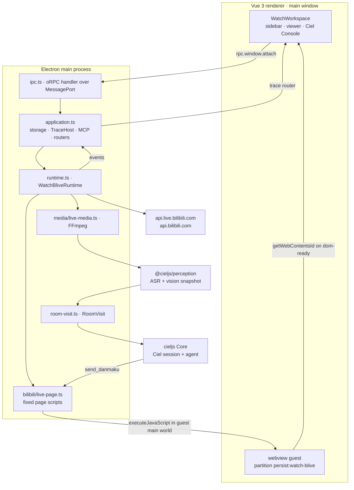
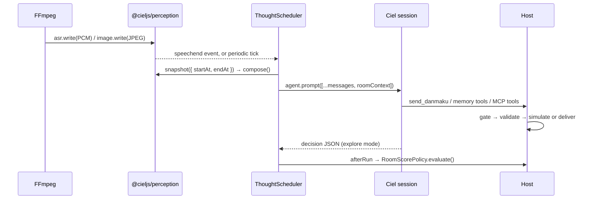

<h1 align="center">watch-blive</h1>

<p align="center">An Electron desktop agent that watches Bilibili livestreams, understands what is being said, and joins the chat with real danmaku.</p>

<p align="center">
  <a href="./README.zh-CN.md">简体中文</a> ·
  <a href="#overview">Overview</a> ·
  <a href="#how-it-works">How it works</a> ·
  <a href="#requirements">Requirements</a> ·
  <a href="#install--configure">Install / Configure</a> ·
  <a href="#usage--run">Usage</a> ·
  <a href="#watching-a-livestream">Watching</a> ·
  <a href="#wake-word">Wake word</a> ·
  <a href="#voiceprints">Voiceprints</a> ·
  <a href="#danmaku">Danmaku</a> ·
  <a href="#recording">Recording</a> ·
  <a href="#investigation">Investigation</a> ·
  <a href="#ciel-console--trace">Ciel Console</a> ·
  <a href="#architecture--directory-layout">Architecture</a> ·
  <a href="#development">Development</a> ·
  <a href="#known-limitations--open-decisions">Limitations</a>
</p>

## Overview

`watch-blive` is a desktop application that embeds a real Bilibili livestream page in an Electron `<webview>`, feeds the stream's audio and frames into [@cieljs/perception](../../packages/perception/README.md), and lets a Ciel agent watch, remember, and talk back through `send_danmaku`.

There are three watch modes. `follow` watches a single room, `explore` lets the agent pick a room from real candidates in a live area, and `recording` analyzes a video or a stream recording and sends no danmaku at all.

Whichever mode is running, the agent only proposes. It drafts danmaku, picks candidates and scores rooms, while the host validates every candidate, owns room switching and serializes open, close and retry — so `send_danmaku` can never stop a session or switch a room on its own.

Real effects stay opt-in: danmaku delivery defaults to `simulate`, and only an explicit `danmakuDelivery: 'live'` (plus a Bilibili login) touches the site.

The app is assembled from this monorepo: [cieljs](../../packages/cieljs/README.md) Core for the agent, [@cieljs/perception](../../packages/perception/README.md) for hearing and vision, [@cieljs/hearing](../../packages/hearing/README.md) for ASR, KWS and voiceprints, [@cieljs/console](../../packages/console/README.md) for the console UI, [@cieljs/trace](../../packages/trace/README.md) for the trace host, [@cieljs/storage](../../packages/storage/README.md) for persistence and [@cieljs/mcp](../../packages/mcp/README.md) for MCP tools.

## How it works



The guest page and the perception media are deliberately separate. The `<webview>` is the only place login, navigation and danmaku exist; the agent's audio and frames come from an independent FFmpeg process, so nothing depends on the page exposing PCM or screenshots.



**One live room = one `RoomVisit`.** A visit owns the room metadata, its generation, the FFmpeg process, the `Perception` instance, the room's `CielSession`, the thought scheduler, the perception subscriptions and the delivered-danmaku history. Switching rooms closes the old visit first and bumps `visitGeneration`, so late callbacks from old audio, old frames and old scores cannot leak into the new room.

**Room and session identity.** [room-session.ts](src/main/agent/room-session.ts) keeps room identity and session identity apart — no account id, no machine timezone:

| Identity          | Rule                                      | Example                                  |
| ----------------- | ----------------------------------------- | ---------------------------------------- |
| Room space        | `bilibili:room:{roomId}`                  | `bilibili:room:123`                      |
| Live session      | `bilibili:room:{roomId}:{YYYY-MM-DD}`     | `bilibili:room:123:2026-09-06`           |
| Recording session | `bilibili:room:{roomId}:recording:{date}` | `bilibili:room:123:recording:2026-09-06` |

The date is the `Asia/Shanghai` calendar date at the moment the room was entered, regardless of the machine's timezone; a recording uses the user-supplied `date` when given. Sessions are opened with `crossSpace: true` and these sources:

- `bilibili:room:{roomId}` — the room itself.
- `bilibili:streamer:{streamerUid}` — stable across renames; the primary way to associate one streamer's sessions and memories.
- `bilibili:streamer-name:{encodeURIComponent(streamerName)}` — a human-readable alias for nickname search.

Titles, descriptions and area names change too often to be sources; they travel in the per-round room context instead.

**State machine.** `WatchStatus` is a discriminated state, never a set of booleans. Every transition is published through `onEvent`.

| Status           | Meaning                                                           |
| ---------------- | ----------------------------------------------------------------- |
| `idle`           | Nothing running; mode can be picked.                              |
| `starting`       | `start()` accepted; account and Ciel are being prepared.          |
| `awaiting-login` | `live` danmaku was requested without a login.                     |
| `exploring`      | Querying an area and asking the agent to pick a candidate.        |
| `opening`        | Navigating the guest, waiting for readiness, opening the session. |
| `watching`       | Media, perception and the thought loop are live.                  |
| `stopping`       | Resources are being released (recording: summary in progress).    |
| `closed`         | `close()` finished; the instance can never start again.           |

## Requirements

| Requirement      | Detail                                                                                                                                                    |
| ---------------- | --------------------------------------------------------------------------------------------------------------------------------------------------------- |
| Node.js          | `>=24.11.1` — from the repo root `engines` field.                                                                                                         |
| pnpm             | `12.4.1` — declared as `packageManager` in the root and app manifests, and as `devEngines.packageManager` (with `onFail: download`).                      |
| Vite+ (`vp`)     | The workspace toolchain. It is a root devDependency and provides `vp run <task>` for this app's tasks.                                                    |
| FFmpeg           | Needed for every mode. Resolution order: `ffmpegPath` in the config → `FFMPEG_PATH` environment variable → `ffmpeg` on `PATH`.                            |
| Bilibili account | Only for real danmaku (`danmakuDelivery: 'live'`). `simulate` runs without login; login happens inside the embedded page.                                 |
| ASR models       | Downloaded on demand from the app sidebar into `<dataDir>/models`. Default model: `qwen3-asr-1.7b-int8`; alternative: `sensevoice-small`.                 |
| Extra models     | The wake model (KWS) downloads automatically the first time wake is enabled; voiceprints need the speaker model, which is part of the ASR model file set. |

> [!NOTE]
> The app never reads the model API key from the environment. It comes from `config.json` only.

## Install / Configure

Install the workspace from the repo root:

```bash
vp install        # or: pnpm install
```

The app reads its configuration from `<dataDir>/config.json`, where `dataDir` is:

| Situation                  | Data root                                                                          |
| -------------------------- | ---------------------------------------------------------------------------------- |
| `WATCH_BLIVE_DATA_DIR` set | that directory (highest precedence)                                                |
| Packaged build             | `~/.ciel`                                                                          |
| Development                | `<process.cwd()>/.ciel` — the repo already carries one at `apps/watch-blive/.ciel` |

`config.example.json` in this directory is the minimal starting point. Copy it to `<dataDir>/config.json` and fill in `ai.apiKey`. Full shape, with every key and its real default:

```json
{
  "ai": {
    "provider": "xiaomi",
    "model": "mimo-v2.5",
    "apiKey": "your-api-key",
    "baseUrl": "https://api.xiaomimimo.com/v1",
    "thinkingLevel": "off"
  },
  "interaction": {
    "minimumThinkIntervalMs": 2000,
    "periodicObservationMs": 10000,
    "thinkTimeoutMs": 60000
  },
  "wake": {
    "keywords": ["夏尔"],
    "minWaitMs": 1500,
    "maxWaitMs": 4000,
    "cooldownMs": 15000
  },
  "ffmpegPath": "C:/Tools/ffmpeg/bin/ffmpeg.exe"
}
```

| Key                                  | Type / range                                                          | Default                              | Meaning                                                                                                                                   |
| ------------------------------------ | --------------------------------------------------------------------- | ------------------------------------ | ----------------------------------------------------------------------------------------------------------------------------------------- |
| `ai.provider`                        | non-empty string                                                      | **required**                         | Provider id registered in `@cieljs/model-kit/models`.                                                                                     |
| `ai.model`                           | non-empty string                                                      | **required**                         | Model id; `provider` + `model` must be a registered pair.                                                                                 |
| `ai.apiKey`                          | non-empty string                                                      | **required**                         | Credential for that provider.                                                                                                             |
| `ai.baseUrl`                         | URL starting with `http://` or `https://`                             | omitted → the model's registered URL | Overrides the request base URL only. Keep the service's path prefix (for example `/v1`). Protocol, provider and model stay as registered. |
| `ai.thinkingLevel`                   | `off` \| `minimal` \| `low` \| `medium` \| `high` \| `xhigh` \| `max` | omitted → the model's default        | Reasoning effort, applied to the room session before its first request.                                                                   |
| `interaction.minimumThinkIntervalMs` | integer ≥ 500                                                         | `2000`                               | Minimum spacing between two thinking runs.                                                                                                |
| `interaction.periodicObservationMs`  | integer ≥ 1000                                                        | `10000`                              | Periodic snapshot interval, so a silent stream still gets reviewed.                                                                       |
| `interaction.thinkTimeoutMs`         | integer ≥ 1000                                                        | omitted → no limit                   | Per-run time budget; the round is aborted when it expires.                                                                                |
| `wake`                               | `false`, or an object                                                 | `{}` → wake enabled with defaults    | `false` turns the wake detector off.                                                                                                      |
| `wake.keywords`                      | non-empty string array                                                | `["夏尔"]`                           | Wake phrases.                                                                                                                             |
| `wake.minWaitMs`                     | integer ≥ 0                                                           | `1500`                               | Collect speech at least this long after a hit before thinking.                                                                            |
| `wake.maxWaitMs`                     | integer ≥ 0, ≥ `minWaitMs`                                            | `4000`                               | Upper bound on the wake wait.                                                                                                             |
| `wake.cooldownMs`                    | integer ≥ 0                                                           | `15000`                              | Repeat hits inside this window are merged.                                                                                                |
| `ffmpegPath`                         | non-empty string                                                      | omitted → `FFMPEG_PATH` → `ffmpeg`   | FFmpeg executable.                                                                                                                        |

Validation runs on every read: a missing file, unparsable JSON, or a schema violation produces a message listing each offending path, and the sidebar shows the failing config path plus that message. `interaction` and `wake` may be omitted entirely.

> [!NOTE]
> `WatchBliveRuntime` captures its options when it is first created, so edits to `ai.*`, `interaction.*`, `wake` and `ffmpegPath` take effect after restarting the app. The sidebar re-reads the file every second, so validation errors and model-file problems show up live.

### Data directory

`prepareWatchResources()` creates and points the app at these locations before Electron is ready:

| Path           | Contents                                                                                                                          |
| -------------- | --------------------------------------------------------------------------------------------------------------------------------- |
| `config.json`  | The AI credentials and options above.                                                                                             |
| `hearing.json` | The selected ASR model (`{ "model": "qwen3-asr-1.7b-int8" }`), written separately so switching models never rewrites credentials. |
| `mcp.json`     | MCP server definition consumed by [@cieljs/mcp](../../packages/mcp/README.md); its tools are exposed to the agent.                |
| `storage/`     | One PGlite database opened with the session, memory, vector and trace modules.                                                    |
| `models/`      | ASR, VAD, speaker and KWS model files (`models/kws/…` for wake).                                                                  |
| `voiceprints/` | `*.voiceprint` speaker profiles.                                                                                                  |
| `cache/`       | Download cache.                                                                                                                   |
| `logs/`        | Application logs (`app.setAppLogsPath`).                                                                                          |
| `electron/`    | Electron session/profile data (`app.setPath('sessionData')`), including the persistent Bilibili cookies.                          |

On startup the app migrates data from `<app path>/.ciel` and `<userData>/.ciel`: `session`, `memory`, `investigation`, `trace` and `mcp.json` directories/files are copied only when the target does not exist, and `models`, `voiceprints`, `cache` are filled in file by file without ever overwriting an existing file. In development it additionally copies the `models` and `voiceprints` directories shipped next to `@cieljs/hearing`.

## Usage / Run

From the repository root:

```bash
vp run watch-blive#dev     # Electron desktop app (also documented in the repo README)
```

Other tasks defined in [vite.config.ts](vite.config.ts):

| Command                                                        | What it does                                                                    |
| -------------------------------------------------------------- | ------------------------------------------------------------------------------- |
| `vp run watch-blive#dev`                                       | `vld dev`, depends on `build`; HMR for the renderer, restarts for main/preload. |
| `vp run watch-blive#start`                                     | `vld preview` — run the built app without the dev server.                       |
| `vp run watch-blive#build`                                     | `vld build`, depends on `typecheck`.                                            |
| `vp run watch-blive#typecheck`                                 | `tsc` for the node project plus `vue-tsc` for the web project.                  |
| `vp run watch-blive#build:unpack`                              | Unpacked directory build via `electron-builder --dir`.                          |
| `vp run watch-blive#build:win` / `#build:mac` / `#build:linux` | Installers via `electron-builder`.                                              |

Packaged builds load the local renderer HTML; no HTTP server is started for the UI.

First run, in order: create `config.json` (the sidebar shows the missing path until you do) → download the hearing model from the sidebar → optionally log in to Bilibili → pick a mode, set the room/area, and press **开始观看** (start watching).

## Watching a livestream

| UI label                    | `mode`                                                                                               | Fields                      | Behaviour                                                                                                               |
| --------------------------- | ---------------------------------------------------------------------------------------------------- | --------------------------- | ----------------------------------------------------------------------------------------------------------------------- |
| 单推 · 只看这位主播         | `{ "type": "follow", "roomId": number }`                                                             | room id                     | Watches that one room and interacts. No scoring, no switching; even if the model suggests leaving, the host ignores it. |
| DD 模式 · 发现感兴趣的直播  | `{ "type": "explore", "areaId": number }`                                                            | live area                   | The agent picks a room from real candidates; the host may switch after the score policy agrees.                         |
| 视频模式 · 总结、分析和记忆 | `{ "type": "recording", "roomId": number, "source": {…}, "date": "YYYY-MM-DD"?, "prompt": string? }` | see [Recording](#recording) | No danmaku at all.                                                                                                      |

Both live modes accept `danmakuDelivery: 'simulate' | 'live'`; the UI exposes it as the **真实发送弹幕** checkbox, and it defaults to `simulate`.

**Follow mode.** `start()` resolves the room with `BilibiliApi.room(roomId)`, opens the visit, and keeps watching until the user stops. The room is never swapped for another one, and if it goes offline watching simply ends: the runtime returns to `idle` and the user starts it again. The UI takes a numeric **直播间 ID** (a room id, not a streamer UID).

**Explore mode.**

```text
query area candidates (20 per page, sorted by online count)
        ↓
drop the current room and rooms still in cooldown
        ↓
agent investigation selects one candidate
        ↓
host validates the room is in this round's candidate list
        ↓
open RoomVisit → observe / interact / score
        ↓
host score policy says switch? ── yes ──▶ close visit → query fresh candidates
                              └─ no ───▶ keep watching
```

- Candidates come from `room/v3/area/getRoomList` with `page_size=20&sort_type=online`; the agent's answer is parsed as `{ roomId, reason }` and rejected unless `roomId` is in this round's list.
- **Cooldown is a hard host guarantee:** every departure (switch, offline, stop, failed open) records the room, and `ROOM_REVISIT_COOLDOWN_MS` is 30 minutes. Cooled rooms never reach the model, and a selection for one fails membership validation.
- If cooling would empty the candidate list, it is relaxed: the current room stays excluded and the rest are handed back oldest-departure-first, with the prompt explaining that the area has nothing else.
- A failed selection only reports an error. The room, its session and its media stay exactly as they were, and the next scoring round decides again — there is no unbounded tool loop.

**Scoring.** In explore mode the agent ends each round with a JSON decision validated against `RoomDecisionSchema`:

```ts
{
  action: 'stay' | 'explore',
  confidence: 0..1,
  danmakuAction: 'send' | 'defer',
  evidence: string[],   // at most 5
  reason: string,
  score: 0..100         // interest in continuing to watch
}
```

A malformed answer is retried once with the tools temporarily removed, so the correction round cannot send danmaku or cause other side effects; if it is still invalid, the round is recorded as an error and no room evaluation happens.

`RoomScorePolicy` is a pure, I/O-free object that turns a stream of evaluations into a switch verdict:

| Rule                                                                                     | Result                                    |
| ---------------------------------------------------------------------------------------- | ----------------------------------------- |
| `score >= 60`                                                                            | Clears the low-score window and stays.    |
| `action: 'explore' && confidence >= 0.85 && score <= 50`                                 | Switch immediately (`confirmed-explore`). |
| The last two rounds both `score <= 20`                                                   | Switch (`sustained-low-score`).           |
| The last two rounds all `action: 'explore' && score <= 50 && confidence >= 0.7`          | Switch (`confirmed-explore`).             |
| Average of the last three rounds `<= 40` with at least two rounds at `confidence >= 0.6` | Switch (`sustained-low-score`).           |

Switching is not allowed at all until `ROOM_REVIEW_AFTER_MS` (45 seconds) have passed in the current room. An objective end — the page reports offline, the room ends, media repeatedly fails — does not wait for that gate.

### Detecting the end of a stream

Every visit owns exactly one `LiveStatusMonitor` (`main/bilibili/live-status-monitor.ts`). Checks are serial: the next one is scheduled 5 s after the previous one finishes, and two checks never overlap.

The page is asked first. `window.livePlayer.getPlayerInfo().liveStatus` is read through the guest page, where `0` (not started) and `2` (carousel, i.e. a looped replay) both count as _not_ a live stream. Only `1` short-circuits the check — an unknown status, a missing player or a page error falls through to `BilibiliApi.room()` and uses `room.live`.

A media exit is never trusted to the page. `mediaStopped()` fires for FFmpeg's normal EOF as well as for an abnormal exit, and that path queries the API directly, because the player can still report `live` from its cached state. If the exit arrives while a page query is already in flight, one extra API verification is done before deciding.

Offline ends the visit. The monitor closes itself and the whole visit is released (session, media, perception, subscriptions); explore mode then picks a new room, while follow mode stops watching and the runtime returns to `idle`. A media exit that is _not_ confirmed offline also releases the visit, and reports a media error (`媒体已退出，且无法确认直播状态` when the status query failed as well). A failed status query on its own is not an offline signal: the visit is kept, the error is reported, and the next tick retries.

Ending a visit is ordered. The runtime first flips to `stopping` and cancels the visit — which blocks further danmaku and aborts the agent that is still thinking — and only then queues the release of the visit's resources, so nothing is sent after the stream has ended. Stopping or switching closes the monitor, aborts an in-flight check and discards late results, so a stale check can never close the room that replaced it.

## Wake word

Live audio is always fed to ASR **and** to an independent keyword spotter; the wake detector never gates recognition. With wake enabled (`wake` omitted, or an object), the first use downloads the KWS model into `<dataDir>/models/kws/…`.

A hit does exactly one thing: it makes the next round think sooner. The scheduler waits at least `minWaitMs` (1500 ms) to collect what follows the keyword, prefers to start right after speech ends, and gives up waiting at `maxWaitMs` (4000 ms); if a run is already active it waits for it to finish. Repeats within `cooldownMs` (15000 ms) and within the same pending wake are merged.

- Being called is not a reason to speak: the wake round's context carries the keyword and the audio timestamp plus an explicit "do not rush to talk" instruction, and the danmaku rules still decide whether anything is sent.
- Wake records are visible in Ciel Console as `关键词唤醒` messages.
- `wake: false` disables the detector. Records cannot be woken; switching rooms or stopping cancels a pending wake.
- `maxWaitMs` bounds host-side scheduling only. It does not promise that ASR has finished transcribing or that the model has answered.

## Voiceprints

Speaker profiles are plain files: every `<dataDir>/voiceprints/*.voiceprint` becomes a profile whose name is the file name without the extension, so `弥生.voiceprint` is reported as `弥生`.

- The directory is rescanned every time a `Perception` instance is created, i.e. on every room open — add, rename or delete files and start watching again.
- A missing `voiceprints` directory simply yields no profiles; a corrupt file fails hearing initialization with an error.
- Voiceprints need the speaker model, which ships with the ASR model files.

## Danmaku

The agent's only site-mutating tool is `send_danmaku`, defined with a TypeBox schema:

```ts
const SendDanmakuSchema = Type.Object({
  action: Type.Union([Type.Literal('send'), Type.Literal('defer')]),
  content: Type.String({ maxLength: 40 }),
  reason: Type.String({ minLength: 1 }),
});
```

Execution order in [agent/tools.ts](src/main/agent/tools.ts):

```text
schema validated
      ↓
action = defer ──▶ emit danmaku_deferred → return { status: 'deferred', reason }
      ↓ send
gate: at most one send_danmaku call per run
      ↓
canSend(): status is watching and the run signal is not aborted
      ↓
room exists → trim → non-empty → normalized duplicate check against this visit
      ↓
delivery = simulate ──▶ emit danmaku_simulated → return { status: 'simulated', content }
      ↓ live
LivePage.sendDanmaku(content): readiness must report the same roomId, generation unchanged
      ↓
POST https://api.live.bilibili.com/msg/send from the page
      ↓
accepted = code === 0 && !riskControl
      ↓
emit danmaku_delivered + append to the visit's delivered history
```

- **`delivered` is the only status that means anything was sent.** `deferred` and `simulated` never claim delivery, and only `delivered` is written into the visit history that the prompt shows as "已真实发送的弹幕".
- Deduplication normalizes case and strips whitespace, punctuation and symbols, so a near-identical rewrite of something already sent in this visit is rejected.
- The page script submits the site's own send API with the page's cookies and `Referer`, reading `csrf` from the readable `bili_jct` cookie. Form fields: `msg`, `roomid`, `csrf_token`, `csrf`, `bubble=0`, `color=16777215`, `fontsize=25`, `mode=1`, `rnd`.
- **Risk control is treated as a rejection.** `code === 0` is not enough: messages equal to `f`, or containing 风控 / 风险 / 频繁 / 系统繁忙 / 稍后再试 / 安全校验 / 验证码 / 人机验证, raise an error and are never retried.
- The tool result is a discriminated union the agent can rely on:

```ts
type DanmakuToolResult =
  | { status: 'deferred'; reason: string }
  | { status: 'simulated'; content: string }
  | { status: 'delivered'; content: string; roomId: number };
```

Prompt-side rules that shape the text: short spoken Chinese, ideally 4–14 characters with a hard cap of 40; use the streamer's nickname when natural; at most one whitelisted emoji tag per message, and a bare `[喝彩]` when someone is singing or just finished. The whitelist currently in [prompts/modes.ts](src/main/prompts/modes.ts):

```text
[dog] [花] [妙] [哇] [爱] [比心] [赞] [滑稽] [吃瓜] [笑哭] [捂脸] [喝彩] [偷笑] [大笑] [惊喜]
[问号] [鼓掌] [大哭] [呆] [流汗] [生气] [加油] [害羞] [抱抱] [摊手] [抱拳] [给力] [耶]
```

## Recording

The recording mode feeds a video URL or local file through FFmpeg instead of the live page. It creates a room-less visit that never sends danmaku.

| Field    | Notes                                                                                                                                                                                                                  |
| -------- | ---------------------------------------------------------------------------------------------------------------------------------------------------------------------------------------------------------------------- |
| Room id  | Required. Used for the space/session identity and shown in events, even though the video is not a live room.                                                                                                           |
| Source   | `{ "type": "url", "url": "https://…" }` — any HTTP(S) or stream address FFmpeg can read — or `{ "type": "file", "path": "…" }` picked from a file dialog filtered to `mp4`, `mkv`, `mov`, `webm`, `flv`, `m4v`, `avi`. |
| `date`   | Optional `YYYY-MM-DD`; replaces the entry date in the session id. Must be a real calendar date.                                                                                                                        |
| `prompt` | Optional scene description, injected into the system prompt as background. Actual content still has to be seen or heard to count.                                                                                      |

Differences from a live visit:

- No danmaku tool is created at all, so the mode cannot send, simulate or suggest danmaku.
- FFmpeg runs without the live reconnect flags, with `-progress pipe:2 -nostats` so progress can be parsed; `video_progress` events report `extracting`, then `recognizing`, then `analyzing`, with processed/total seconds.
- The image timestamps follow media time (`imageCount × 60000/9`) rather than wall-clock time, so sped-up extraction does not pile every frame into one time window.
- Perception retention is set to the largest value a `Date` can represent, so the whole video stays readable until it is summarized.
- ASR transcripts are recorded into the trace as `视频语音 · mm:ss` messages, which makes the recording's speech reviewable in Ciel Console.
- A natural end emits `recording_finished` and then asks for a full summary; pressing **停止并总结** calls `finishRecording(signal, true)` and asks for a partial summary that must state it is partial. A crash or abort only releases resources — an unfinished video is never summarized as if it had been watched to the end.

## Investigation

The header's **Investigation** button opens a separate window (`?view=investigation`) running `InvestigationChat` from [@cieljs/investigation](../../packages/investigation/README.md), with its own oRPC routers: `investigation` for conversation management and `investigationTrace` for the trace records of investigation sessions only.

- A conversation targets either `{ "type": "global" }` or a room; a room target becomes `{ spaceId: 'bilibili:room:{roomId}' }` plus the room's sources, and picks up the live session id while that room is being watched.
- Session ids are `investigation:global:<uuid>` and `investigation:room:<roomId>:<uuid>`; they are restored from trace history when the window is reopened.
- Asking a question runs `ciel.investigate({ sessionId, target, question, memoryAccess: 'read-write', crossSpace: true, sources })`, so investigation conversations may read across spaces and may write memory for their target.
- Titles are provisional for a moment and then replaced by a generated title (at most 48 characters, stripped of quotes and punctuation); they can also be renamed manually.
- One question at a time per conversation; a new one is rejected while the previous is still running, and `abort` cancels the active one.

Room selection during explore mode uses a separate, deliberately isolated investigation: target `{ type: 'global' }`, `crossSpace: true`, sources `['bilibili:area:{areaId}']`, the exploration system prompt, and no memory write access and no danmaku tool. Candidates are passed in the question text, and the answer is validated by the host.

## Ciel Console / trace

The right sidebar is [@cieljs/console](../../packages/console/README.md), wired to the `trace` router with the active room session id:

```vue
<CielConsole
  :client="rpc.trace"
  :session-id="activeSessionId"
  :auto-scroll="active"
  :tool-renderers="toolRenderers"
  :message-renderers="messageRenderers"
/>
```

- Both sidebars collapse and can be dragged to resize; the viewer takes the remaining space. The left sidebar holds account controls, runtime setup (config status and ASR model install/switch), watch controls and a rolling 60-entry event timeline.
- `TraceHost.open({ storage, awaitReplay: false })` keeps history replay off the startup path. Every runtime event is recorded with `trace.record(event.type, event)` and forwarded to the renderer as a bridge event.
- Tool calls get purpose-built renderers instead of raw JSON: `send_danmaku`, `get_streamer_dynamics`, `get_streamer_videos`.
- Assistant messages whose JSON carries `action` and `score` are rendered as a room decision card.
- The header's compress button calls `runtime.compactContext()` → `visit.session.compact()`, and reports whether a new summary was actually produced.
- The `trace` router excludes sessions whose id starts with `investigation:`; those belong to `investigationTrace`, so the watch console only ever shows watching sessions.

## Architecture / Directory layout

```text
apps/watch-blive/
  config.example.json      minimal config.json template
  vite.config.ts           Vite+ tasks for this app (dev / build / typecheck / packaging)
  build/                   electron-builder icons and macOS entitlements
  resources/icon.png
  src/
    main/
      index.ts                     Electron lifecycle, window, guest hardening, shutdown
      application.ts               storage, TraceHost, MCP, routers, runtime lifetime
      ipc.ts                       MessagePort registration, sender validation, teardown
      runtime.ts                   WatchBliveRuntime: state machine, modes, ownership
      room-visit.ts                one visit: perception + media + session + scheduler
      room-score-policy.ts         pure multi-round switch policy
      room-history.ts              30-minute revisit cooldown and candidate filtering
      browse-window.ts             singleton Bilibili browsing window
      investigation-window.ts      Investigation window and its sender check
      config.ts                    config schema, data directory, resource migration
      hearing-settings.ts          ASR model selection persisted next to the config
      voiceprints.ts               *.voiceprint discovery
      resources.ts                 copy-missing migration helper
      shutdown.ts                  ordered, all-settled shutdown coordination
      user-agent.ts                shared desktop Chrome User-Agent
      agent/
        ciel.ts                    defineCiel: model, prompts, tools, investigation prompt
        tools.ts                   send_danmaku + per-run gate
        decisions.ts               RoomSelection / RoomDecision schemas and parsing
        exploration.ts             candidate query, cooldown filter, investigation call
        room-session.ts            room space, dated session, sources
        streamer-tools.ts          get_streamer_dynamics / get_streamer_videos
      bilibili/
        api.ts                     area, room, candidate, play URL, dynamics, videos
        live-page.ts               guest ownership, navigation, login, readiness, danmaku
        page-executor.ts           typed executeJavaScript + URL allowlist
        page-scripts.ts            the fixed scripts that run inside the guest
        send-danmaku.ts            the site send API call and risk-control detection
        live-status.ts             page status first, API verification as fallback
        live-status-monitor.ts     periodic offline / media-failure detection
        wait-for-page.ts           polling helper with an independent timeout
      media/live-media.ts          FFmpeg lifecycle, PCM/JPEG demux, progress parsing
      prompts/                     persona, live rules, mode rules, room context,
                                   perception context, emoji whitelist
      routes/                      account/watch/setup/recording/window oRPC routes
      scheduling/
        thought-scheduler.ts       single-flight thinking, merge, interval, timeout
        wake.ts                    wake options and the wake context
    preload/index.ts               hands the MessagePort to the main process
    renderer/                      Vue 3 shell: App.vue, rpc.ts, components,
                                   composables, theme
    shared/
      types.ts                     WatchMode, StartWatchOptions, RoomInfo, WatchEvent…
      ipc.ts                       bridge types (oRPC client contract)
      schemas.ts                   TypeBox schemas shared by main and renderer
```

| Module                                    | Responsibility                                                                                                    |
| ----------------------------------------- | ----------------------------------------------------------------------------------------------------------------- |
| `main/runtime.ts`                         | Status machine, follow/explore/recording strategy, `RoomVisit` ownership, serialized start/switch/stop.           |
| `main/application.ts`                     | Opens the database once, owns TraceHost, MCP, the live page and the runtime, and builds the router.               |
| `main/ipc.ts`                             | Registers the MessagePort channel synchronously, validates senders, releases ports on navigation.                 |
| `main/bilibili/live-page.ts`              | Holds the guest `WebContents`, invalidates generations, and is the only path that drives the page.                |
| `main/bilibili/page-executor.ts`          | Wraps `executeJavaScript` in an async IIFE, enforces timeout/abort/generation/URL checks, validates with TypeBox. |
| `main/media/live-media.ts`                | Builds the FFmpeg argument list, splits PCM and JPEG streams, tracks pending writes before close.                 |
| `main/scheduling/thought-scheduler.ts`    | Single-flight runs, newest-pending merge, minimum interval, optional timeout, wake windows.                       |
| `renderer/components/LiveRoomWebview.vue` | Keeps one `<webview>` mounted and reports its `WebContents ID` once.                                              |

### Renderer, styling and login

- The renderer is Vue 3 with Tailwind CSS 4 (`@tailwindcss/vite`). Layout lives in the SFC utility classes, shared controls keep semantic class names through `@apply`, and the Electron-specific pieces — drag regions and scrollbars — stay plain CSS. The migration preserved the original colours, spacing, fonts, collapsed layout and interaction states.
- Login happens inside the guest page and is only _observed_ by the host: `waitForLogin()` polls the page's `BilibiliLive.UID` every 1.5 s and requests the account only once the UID is a definite non-zero value, so an anonymous session never spams the account API. The wait gives up after 6 minutes, and success, cancellation and failure all clear their timers. An account that is resolved is pushed straight into the sidebar.

### Security boundaries

- The renderer never calls `executeJavaScript`; page execution lives only in the main process, and `code` always comes from the fixed scripts in the repository, never from the model.
- Dynamic values are `JSON.stringify`-ed before they enter a script; raw string interpolation is not used.
- The main window uses `contextIsolation: true`, `nodeIntegration: false`, `sandbox: false` (the preload is ESM) and `webviewTag: true`. Every attached guest is forced to `sandbox: true` with an unknown preload removed, and `will-attach-webview` rejects any src outside the allowlist.
- Navigation and page execution are limited to `https://bilibili.com` / `https://*.bilibili.com`, plus `about:blank`. `setWindowOpenHandler` always denies; a room link opened from the guest is turned into a `room_requested` event instead.
- The renderer talks to the main process through oRPC over a MessagePort. The preload only forwards a port for a same-origin `watch-blive:connect` message; the main process accepts only the main window's main frame or the Investigation window's main frame, requires exactly one port, and drops connections on navigation.
- The agent cannot reach `executePage`; its only mutating tool is `send_danmaku`. Cookies are used for login checks and page requests only — never logged, never placed in prompts, sessions or memories.

## Development

```bash
vp install                       # workspace install
vp check                         # format, lint and type-aware checks
vp test                          # Vitest; the root config registers apps/* as projects
vp run watch-blive#typecheck     # tsc (node) + vue-tsc (web) for this app
vp run watch-blive#build         # build main, preload and renderer
```

`vp run watch-blive#test` does not exist — this app defines no `test` task. Tests are colocated `*.test.ts` files next to the source they cover (config loading, page execution, danmaku sending, score policy, scheduler, room history, decisions, exploration, session identity, prompts, shutdown, resources, voiceprints, IPC-facing routes) and are picked up by the workspace Vitest projects.

The app has no `scripts` field in its `package.json`; every runnable task lives in [vite.config.ts](vite.config.ts) and is invoked through `vp run watch-blive#<task>`.

> [!TIP]
> The main process opens DevTools whenever a live guest attaches, which is convenient while wiring page behaviour and noisy in normal use.

## Known limitations & open decisions

These are inherited from the design work and are still true of the code as written.

Delivery cannot be proven end to end. The best available signal is `code === 0 && !riskControl` from the page's own send API, and a response can look accepted while never appearing on stream — "delivered" means the site did not reject it, not that viewers saw it. A real send still has to be verified by hand with a test account. Asking for `live` delivery has no confirmation dialog either: the design left that open (`AlertDialog` or not), so there is only a hint next to the checkbox and the internal default stays `simulate`. The emoji whitelist is prompt-only as well, because nothing in the code validates emoji tags before the request; whether every listed tag is still accepted has to be re-checked against the real page.

The Electron hardening is conservative but not complete. The navigation allowlist accepts any `https://*.bilibili.com` page, where the design wanted a minimal per-page allowlist covering login, home and livestream pages. No guest permission-request handler is installed, so the code leans on the sandbox, that allowlist and `setWindowOpenHandler` instead. And the `<webview>` sets `allowpopups` even though the design asked to leave it off, mitigated by denying every popup and turning a room-shaped URL into a `room_requested` event.

A few policies are still open or only partly wired. Follow mode takes a numeric room id rather than a streamer UID — `BilibiliApi.roomByStreamer` exists but the runtime never calls it — so a streamer who changes room number is not followed automatically. Room cooldown lives in process memory, which means a restart forgets the last 30 minutes; that is deliberate, since the window usually falls inside one run, but it is not persisted. Exploration investigations receive only `bilibili:area:{areaId}` as a source, so the candidate rooms and streamers travel in the question text and those rooms' sessions and memories cannot be discovered by source. `ai.thinkingLevel` is applied to the room session at its first request, and whether anything else should follow it has not been decided. The think cadence is untuned: the config defaults (2000 ms minimum interval, 10000 ms periodic observation) are much tighter than the 20 s / 45 s the design proposed, and `WatchBliveRuntime` falls back to 5000 ms / 30000 ms when used directly without config.

Two leftovers from the refactor are still visible. There is no `.ciel/trace` directory any more — trace records live in the same PGlite `storage/` database as sessions and memories, which is why migration still probes the older `session`, `memory`, `investigation` and `trace` paths. And `shared/ipc.ts` still declares the `WATCH_BLIVE_IPC` channel names that nothing references, while the live bridge is the oRPC router.

Finally, the page scripts depend on site internals: `window.livePlayer`, `window.__NEPTUNE_IS_MY_WAIFU__`, `window.BilibiliLive.UID`, the `.header-login-entry` element and `bili_jct`. A redesign of the site breaks readiness, live status or danmaku until the scripts are updated.
